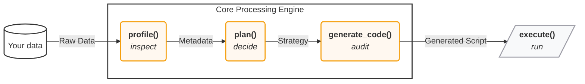

<h1 align="left">
    
</h1>

<p align="center">
  
  
  <a href="https://github.com/JoaquinAmatRodrigo/skforecast"></a>
</p>

**An AI forecasting assistant you can trust.** `skforecast-ai` pairs a **deterministic forecasting engine** (built on [`skforecast`](https://skforecast.org)) with an **LLM reasoning layer**. Give it a time series and it profiles the data, selects a model using established best practices, evaluates it, and returns the forecast, along with the *exact, runnable* `skforecast` script that produced it.

The engine is **100% deterministic**: the same data always yields the same result. The LLM is a **reasoning layer that explains decisions but never makes them**: it interprets backtesting metrics, diagnoses errors, and suggests improvements you can choose to apply, but it never alters the underlying math. No black boxes, no hallucinated numbers.

---

## ✨ Why skforecast-ai?

- 🎯 **Deterministic by design**: a transparent, rule-based engine. Same input → same output, every time. No hallucinated numbers.
- 🔍 **Code you can trust**: the script you see is *exactly* the code that ran (`result.code`). Inspect it, version it, or run it standalone with plain `skforecast`.
- ⚡ **From data to forecast in one call**: automatic data profiling, model and estimator selection, lag/feature engineering, and backtest evaluation.
- 💬 **LLM reasoning layer**: explains the decisions the engine made, in plain language. It never touches the math.
- 🔌 **Runs locally, no API key**: the full forecasting pipeline works offline. The LLM reasoning layer is optional.
- 🏗️ **Built on skforecast**: recursive & direct forecasters, multi-series, statistical, and foundation models (Chronos-2, TimesFM, Moirai, and more), backed by a mature ecosystem.

---


## 📦 Installation

```bash
pip install skforecast-ai
```

To enable the optional LLM assistant:

```bash
pip install "skforecast-ai[llm]"
```

<details>
<summary>Install from source (for development)</summary>

```bash
git clone https://github.com/JoaquinAmatRodrigo/skforecast-ai.git
cd skforecast-ai
pip install -e ".[dev]"
```
</details>

Requires Python ≥ 3.10.

---

## 🚀 Quickstart

From raw data to a validated forecast, and the code behind it, in under ten lines:

```python
import pandas as pd
from skforecast_ai import ForecastingAssistant
from skforecast.datasets import load_demo_dataset

data = load_demo_dataset(verbose=False).to_frame().reset_index()
assistant = ForecastingAssistant()
result = assistant.forecast(data=data, target="y", steps=12, date_column="datetime")

print(result.predictions)   # forecast for the next 12 steps
print(result.metrics)       # evaluation metrics: MAE, MSE, MASE, MAP...
print(result.code)          # the exact skforecast script that produced this result
```

That single `forecast()` call profiled the data, chose a forecaster and estimator, generated a `skforecast` script, and executed it, and `result.code` is the literal script that ran.

👉 New here? Walk through it step by step in **[Your first forecast](docs/user_guides/first-forecast.md)**.

---

## 🧠 How it works

Every forecast flows through four transparent, inspectable stages:



1. **Profile**: inspect the data (frequency, gaps, missing values, exogenous columns).
2. **Plan**: choose the forecaster, estimator, lags, and metrics using transparent rules. Use `refine_plan()` to override any decision before generating code.
3. **Generate**: render a standalone, human-readable `skforecast` script.
4. **Execute**: run that exact script and return predictions, metrics, and the code.

The LLM reasoning layer can read each stage to *explain* decisions and *suggest improvements*.

```python
assistant = ForecastingAssistant(llm="openai:gpt-4o-mini")
answer = assistant.ask("Why was this model chosen?", forecast_result=result)
print(answer.explanation)
```

Read more in **[How it works & trust](docs/user_guides/how-it-works-and-trust.md)**.

---

## 📚 Documentation

| Guide | What it covers |
| --- | --- |
| [Your first forecast](docs/user_guides/first-forecast.md) | Data → forecast in a few lines (start here) |
| [The forecasting workflow](docs/user_guides/the-forecasting-workflow.md) | `profile → plan → refine_plan → forecast`, step by step |
| [How it works & trust](docs/user_guides/how-it-works-and-trust.md) | Determinism, the `exec()` fidelity guarantee, and privacy |
| [Understanding your data](docs/user_guides/understanding-your-data.md) | What profiling detects and how to read it |
| [Customizing the model](docs/user_guides/customizing-the-model.md) | Override the forecaster, estimator, horizon, or intervals |
| [Backtesting & validation](docs/user_guides/backtesting.md) | Rigorous walk-forward evaluation |
| [Using the AI assistant](docs/user_guides/using-the-ai-assistant.md) | *(optional)* Configure an LLM and ask questions |
| [Foundation models](docs/user_guides/foundation-forecasting.md) | Zero-shot forecasting with Chronos-2 and friends |
| [Human-in-the-loop](docs/user_guides/human-in-the-loop.md) | Forecast → ask → refine → re-run, end to end |

---

## 🤝 Contributing

Contributions are welcome, whether it's a bug report, a feature idea, or a pull request. Please see the [Contributing Guide](CONTRIBUTING.md) and our [Code of Conduct](CODE_OF_CONDUCT.md) to get started.

## 📄 License

Licensed under the Apache License 2.0 (see [LICENSE](LICENSE) for details).

Built with ❤️ on top of [skforecast](https://skforecast.org).