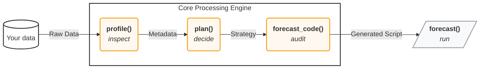

<div style="margin-bottom: 20px;">
    
    
</div>

<div style="clear: both;"></div>


[](https://pypi.org/project/skforecast-ai/)
[](https://github.com/skforecast/skforecast-ai/actions/workflows/unit-tests.yml)
[](https://www.repostatus.org/#active)
[](https://github.com/skforecast/skforecast-ai/graphs/commit-activity)
[](https://pepy.tech/project/skforecast-ai)
[](https://pypistats.org/packages/skforecast-ai)
[](https://github.com/skforecast/skforecast-ai/blob/main/LICENSE)
[](https://www.paypal.com/donate/?hosted_button_id=D2JZSWRLTZDL6)
[](https://www.buymeacoffee.com/skforecast)

[](https://opencollective.com/skforecast)
[](https://www.linkedin.com/company/skforecast/)
[](https://discord.gg/3V52qpNkuj)
[](https://cienciadedatos.net/en/forecasting-python)
[](https://studio.skforecast.org/)

---

**An AI forecasting assistant built on a deterministic engine.** skforecast-ai pairs a deterministic forecasting engine (built on [`skforecast`](https://skforecast.org)) with an **LLM reasoning layer**. Give it a time series and it profiles the data, selects a model using established best practices, evaluates it, and returns the forecast along with the runnable `skforecast` script that produced it.

---


## ✨ Why skforecast-ai?

- 🎯 **Deterministic by design**: a rule-based engine. Same input → same output, every time.
- 🔍 **Code you can inspect**: the script you see is the code that ran (`result.code`). Inspect it, version it, or run it standalone with plain `skforecast`.
- ⚡ **From data to forecast in one call**: automatic data profiling, model and estimator selection, lag/feature engineering, and backtest evaluation.
- 💻 **Python or terminal**: drive the full pipeline from a few lines of Python or from the command line.
- 💬 **LLM reasoning layer**: explains the decisions the engine made, in plain language. It never touches the math.
- 🔌 **Runs locally, no API key**: the forecasting pipeline works offline. The LLM reasoning layer is optional.
- 🏗️ **Built on skforecast**: recursive & direct forecasters, multi-series, statistical, and foundation models (Chronos-2, TimesFM, Moirai, and more).

---

## 📦 Installation

Requires Python ≥ 3.10.

```bash
pip install skforecast-ai
```

To enable the optional LLM reasoning layer:

```bash
pip install "skforecast-ai[llm]"
```

<details>
<summary>Install from source (for development)</summary>

```bash
git clone https://github.com/skforecast/skforecast-ai.git
cd skforecast-ai
pip install -e ".[dev]"
```
</details>

---

## 🚀 Quickstart (Python)

From raw data to a validated forecast, and the code behind it, in a few lines:

```python
import pandas as pd
from skforecast_ai import ForecastingAssistant
from skforecast.datasets import load_demo_dataset

data = load_demo_dataset(verbose=False)
assistant = ForecastingAssistant()
result = assistant.forecast(data=data, target="y", steps=12)

print(result.predictions)   # forecast for the next 12 steps
print(result.metrics)       # evaluation metrics: MAE, MSE, MASE...
print(result.code)          # the exact skforecast script that produced this result
```

That single `forecast()` call profiled the data, chose a forecaster and estimator, generated a `skforecast` script, and executed it. `result.code` is the script that ran.

The returned `ForecastResult` exposes everything the pipeline produced:

| Attribute | What it holds |
| --- | --- |
| `result.predictions` | Forecast for the requested horizon (includes interval columns when `interval` is requested) |
| `result.metrics` | Backtest evaluation metrics (MAE, MSE, MASE) |
| `result.code` | The runnable `skforecast` script that produced the result |
| `result.profile` | What profiling detected about your data |
| `result.plan` | The forecaster, estimator, lags, and metrics that were chosen |

👉 New here? Walk through it step by step in **[Your first forecast](user_guides/first-forecast.md)**.

---

## 💻 Quickstart (CLI)

The same pipeline runs from the terminal. Point it at a CSV file or URL:

```bash
# End-to-end forecast (profile → plan → code → forecast)
skforecast-ai forecast data.csv --target y --date-column datetime --steps 12

# Just inspect the data
skforecast-ai profile data.csv --target y --date-column datetime

# Generate a standalone, runnable script without executing it
skforecast-ai forecast-code data.csv --target y --date-column datetime --steps 12 --output forecast.py
```

Run `skforecast-ai --help` or `skforecast-ai <command> --help` for inline documentation on any command.

👉 Full command reference in **[CLI usage](user_guides/cli-usage.md)**.

---

## 🧠 How it works

Every forecast flows through four inspectable stages:



1. **Profile** (`profile()`): inspect the data (frequency, gaps, missing values, exogenous columns).
2. **Plan** (`plan()`): choose the forecaster, estimator, lags, and metrics using transparent rules. Use `refine_plan()` to override any decision before generating code.
3. **Generate** (`forecast_code()`): render a standalone `skforecast` script.
4. **Execute** (`forecast()`): run that script and return predictions, metrics, and the code.

Need rigorous walk-forward evaluation? `backtest()` runs the same plan through time-series cross-validation and returns per-fold metrics.

The LLM reasoning layer can read each stage to *explain* decisions and *suggest improvements*:

```python
assistant = ForecastingAssistant(llm="openai:gpt-4o-mini", api_key="YOUR_API_KEY")
answer = assistant.ask("Why was this model chosen?", forecast_result=result)
print(answer.explanation)
```

Read more in **[How it works & trust](user_guides/how-it-works-and-trust.md)**.

---

## 📚 Documentation

| Guide | What it covers |
| --- | --- |
| [Your first forecast](user_guides/first-forecast.md) | Data → forecast in a few lines (start here) |
| [The forecasting workflow](user_guides/the-forecasting-workflow.md) | `profile → plan → refine_plan → forecast`, step by step |
| [How it works & trust](user_guides/how-it-works-and-trust.md) | Determinism, the `exec()` fidelity guarantee, and privacy |
| [Understanding your data](user_guides/understanding-your-data.md) | What profiling detects and how to read it |
| [Customizing the model](user_guides/customizing-the-model.md) | Override the forecaster, estimator, horizon, or intervals |
| [Backtesting & validation](user_guides/backtesting.md) | Rigorous walk-forward evaluation |
| [CLI usage](user_guides/cli-usage.md) | Run the full pipeline from the terminal |
| [Using the AI assistant](user_guides/using-the-ai-assistant.md) | *(optional)* Configure an LLM and ask questions |
| [Foundation models](user_guides/foundation-forecasting.md) | Zero-shot forecasting with Chronos-2 and friends |
| [Human-in-the-loop](user_guides/human-in-the-loop.md) | Forecast → ask → refine → re-run, end to end |

---

## 🤝 Contributing

Contributions are welcome, whether it's a bug report, a feature idea, or a pull request. Please see the [Contributing Guide](https://github.com/skforecast/skforecast-ai/blob/main/CONTRIBUTING.md) and our [Code of Conduct](https://github.com/skforecast/skforecast-ai/blob/main/CODE_OF_CONDUCT.md) to get started.

---

## 📖 Citation

If you use `skforecast-ai` in your work, please cite the underlying `skforecast` library:

**Zenodo**

```
Amat Rodrigo, Joaquin, & Escobar Ortiz, Javier. (2026). skforecast (v0.23.0). Zenodo. https://doi.org/10.5281/zenodo.8382787
```

**APA**:
```
Amat Rodrigo, J., & Escobar Ortiz, J. (2026). skforecast (Version 0.23.0) [Computer software]. https://doi.org/10.5281/zenodo.8382787
```

**BibTeX**:
```
@software{skforecast,
  author  = {Amat Rodrigo, Joaquin and Escobar Ortiz, Javier},
  title   = {skforecast},
  version = {0.23.0},
  month   = {6},
  year    = {2026},
  license = {BSD-3-Clause},
  url     = {https://skforecast.org/},
  doi     = {10.5281/zenodo.8382787}
}
```

View the [citation file](https://github.com/skforecast/skforecast/blob/master/CITATION.cff).

---

## 📄 License

Licensed under the Apache License 2.0 (see [LICENSE](LICENSE) for details).

Built with ❤️ on top of [skforecast](https://skforecast.org).