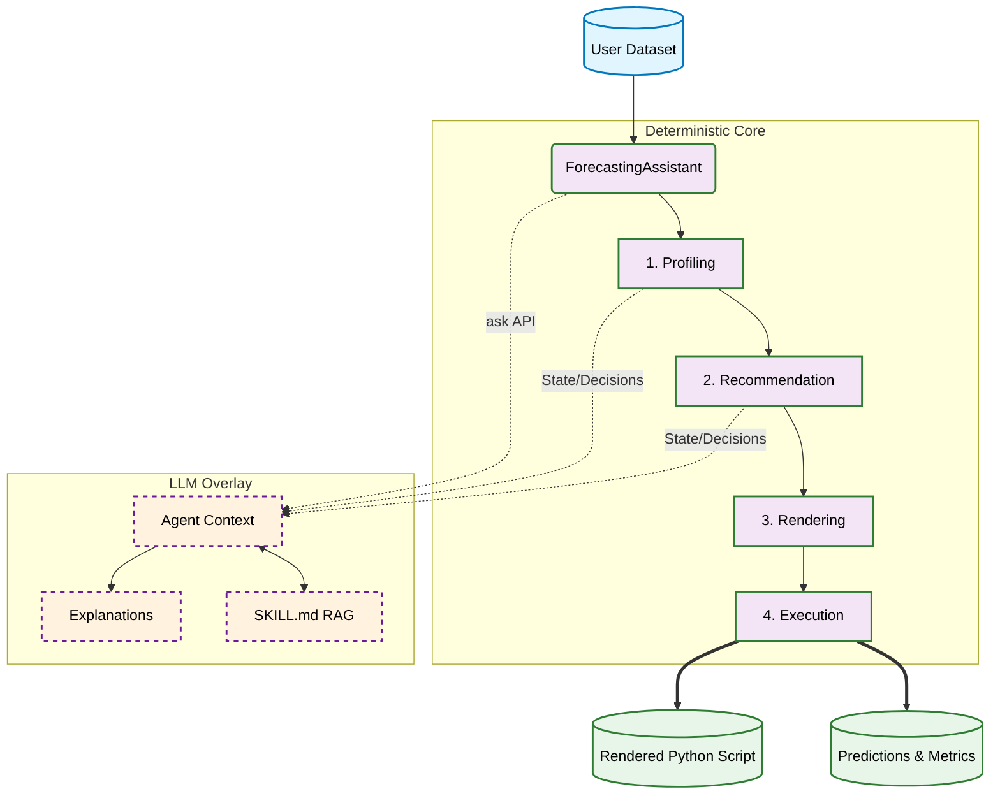
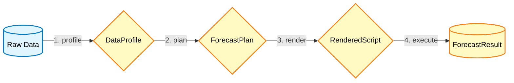
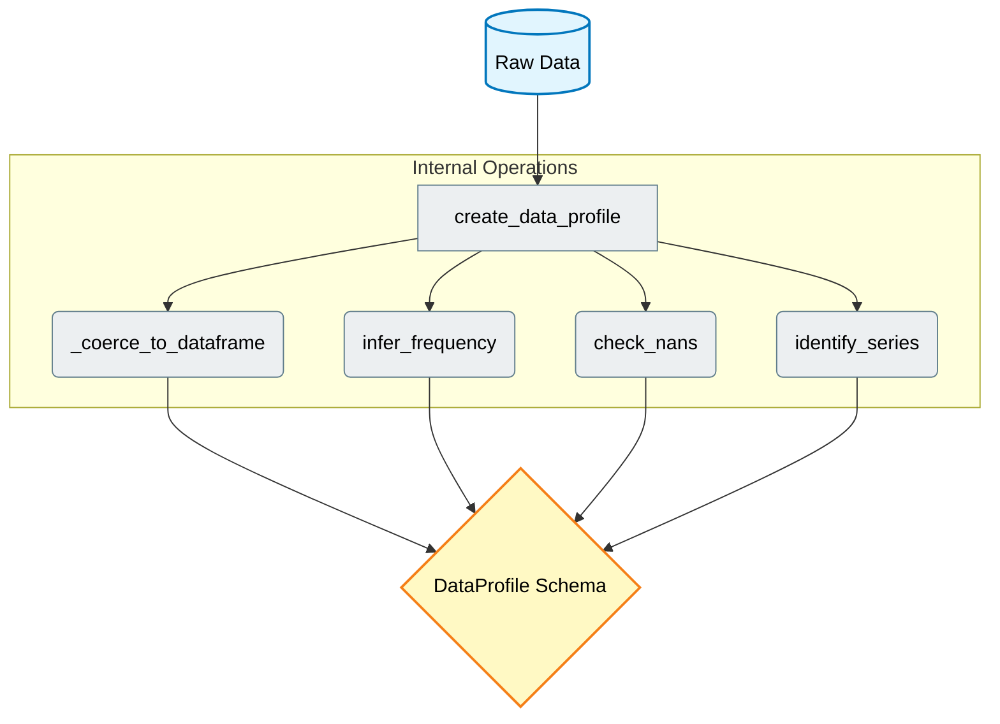
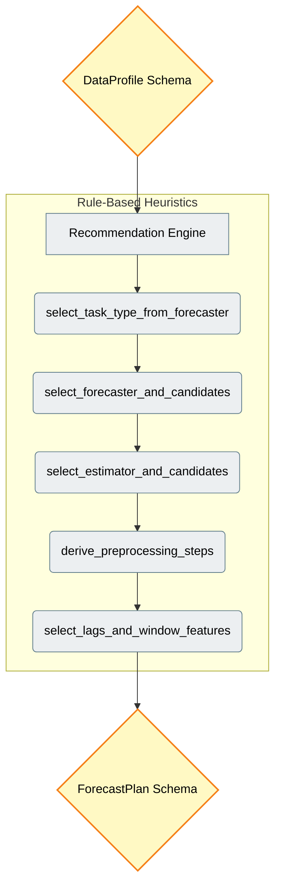
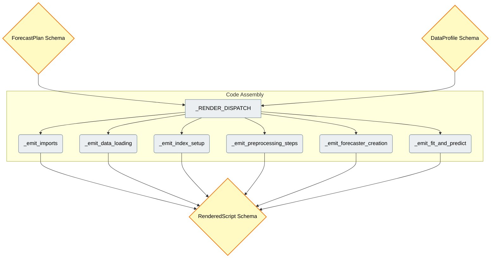
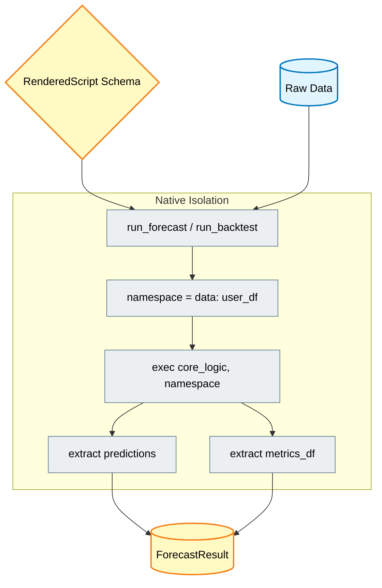
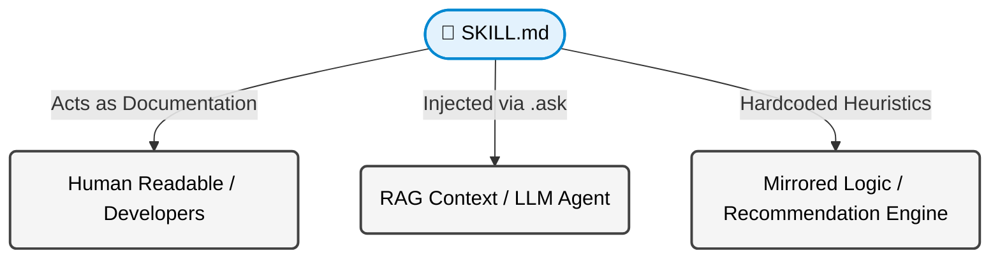

# Architecture & Logic

**skforecast-ai** is built on a unique architectural philosophy that completely separates *execution* from *reasoning*. This design ensures that all forecasting results are 100% deterministic, testable, and reproducible, while simultaneously leveraging the conversational and explanatory power of Large Language Models (LLMs) to guide the user.

This guide exhaustively details the internal structure, the state transformations within the forecasting pipeline, and the "Knowledge as Code" pattern that grounds the LLM.

---

## 1. High-Level Architecture

At its core, `skforecast-ai` operates as a rigid, rule-based inference engine. The LLM does not write code blindly; instead, it acts strictly as an *observer* and *explainer* of the deterministic pipeline.

### Modes of Operation
*   **Deterministic Mode (Default):** Runs the pipeline from profiling to execution. It generates deterministic `skforecast` code and predictions without requiring an internet connection or an API key.
*   **LLM Mode:** Activated when an LLM provider (e.g., `openai:gpt-4o`) is configured. The assistant reads the internal pipeline state (e.g., understanding *why* an `LGBMRegressor` was chosen over `Ridge`) and communicates this to the user via the `.ask()` interface.

---

## 2. The Forecasting Pipeline

The deterministic core follows a strictly functional pipeline design. Data flows sequentially through discrete stages, with each stage applying pure functions to transform an immutable `pydantic` schema into the next.

### Stage 1: Profiling (`skforecast_ai.profiling`)

The pipeline begins by inspecting the raw user dataset. This stage acts as a robust data validator and metadata extractor. It **does not** fit any models or analyze statistical target relationships; its sole purpose is to understand the structural limitations of the input data.

**Key Operations:**
- **Index Analysis:** Detects the frequency (e.g., daily, monthly) and validates if the index is monotonic and complete.
- **Missing Values Tracking:** Precisely locates `NaN` values. The presence of NaNs heavily dictates which downstream preprocessing steps or machine learning estimators are viable.
- **Output:** A strongly typed `DataProfile` object. This schema acts as the immutable ground truth about the dataset for the rest of the pipeline.

### Stage 2: Recommendation (`skforecast_ai.recommendation`)

This is the "Brain" of the deterministic engine. Using a series of hardcoded, sequential business rules, it evaluates the `DataProfile` to determine the optimal forecasting architecture. This transparent heuristic approach intentionally avoids the "black box" nature of traditional AutoML.

**Key Operations:**
- **Task Resolution:** Identifies if the problem requires a `single_series`, `multi_series`, `multivariate`, or `foundation` architecture.
- **Forecaster & Estimator Selection:** Determines the core modeling classes. For example, it defaults to `Ridge` for small datasets (<250 observations) to prevent overfitting, transitioning to `LGBMRegressor` for larger datasets.
- **Hyperparameter Derivation:** Calculates safe default parameters (like the number of lags based on the inferred frequency) and injects necessary data transformers (e.g., missing value imputers or standard scalers) to ensure the generated model can compile safely.
- **Output:** A `ForecastPlan` object. This is a comprehensive, declarative blueprint detailing exactly *how* the forecast will be executed, independently of any actual Python code.

### Stage 3: Rendering (`skforecast_ai.rendering`)

The rendering engine acts as a dynamic code generator. It translates the abstract `ForecastPlan` into a concrete, human-readable Python script, ensuring the user can audit, modify, or independently deploy the code.

**Key Operations:**
- **Code Assembly:** Dynamically builds the script line-by-line via specialized helper functions. It handles the injection of `pandas` index validation logic and complex `skforecast` pipeline instantiation.
- **Formatting:** Applies rigorous string formatting rules (e.g., `_emit_aligned_kwargs`) so the generated script is not just executable, but highly idiomatic and visually structured.
- **Output:** A `RenderedScript` object containing valid Python code, logically split into sections (`imports`, `data_loading`, `core_logic`).

### Stage 4: Execution (`skforecast_ai.execution`)

To guarantee absolute fidelity—meaning the code shown to the user is *exactly* the code generating the results—`skforecast-ai` dynamically compiles and executes the `RenderedScript` using Python's native `exec()` function within an isolated programmatic namespace.

**Key Operations:**
- **Environment Setup:** Loads the user's actual `pandas.DataFrame` directly into the dictionary namespace (`namespace = {"data": data}`). This avoids expensive disk I/O (like writing temporary CSVs) during execution.
- **State Extraction:** Following execution, the runner safely extracts the newly instantiated model (`forecaster`), the generated predictions DataFrame, and calculated performance metrics (like MAE or RMSE) back out of the namespace.
- **Output:** A standard dictionary containing the final `pandas` objects and the raw executed code, ready for downstream use or user inspection.

---

## 3. "Knowledge as Code" (Skills)

A critical challenge in AI assistants is keeping the LLM's knowledge synchronized with the codebase's logic. If the recommendation engine dictates one rule, but the LLM explains another based on outdated pre-training data, user trust is destroyed.

`skforecast-ai` solves this utilizing the **Knowledge as Code** pattern. Business rules and heuristic thresholds are extracted into isolated Markdown files called **Skills** (located in `skforecast_ai/skills/`).

**Architectural Benefits:**
1. **Single Source of Truth:** When the core team adopts a new forecasting best practice, they update the `SKILL.md` file. The documentation and the LLM context update instantly.
2. **Contextual Grounding:** When the user asks the LLM a question (e.g., *"Why did you choose Ridge instead of XGBoost?"*), the agent reads the relevant skill file to ground its answer in `skforecast`'s actual architectural rules, eliminating AI hallucinations.
3. **Total Transparency:** Users can browse the `skforecast_ai/skills/` directory on GitHub to understand exactly the rules the assistant is bound by.