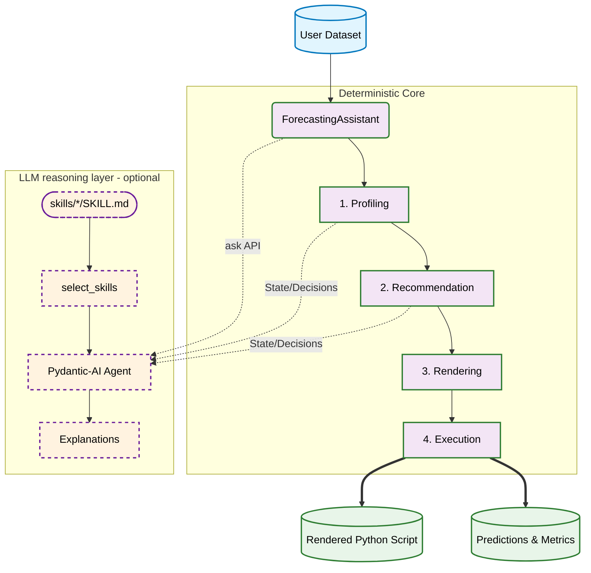
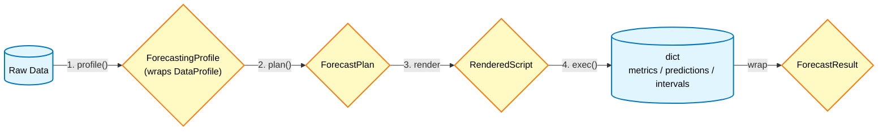
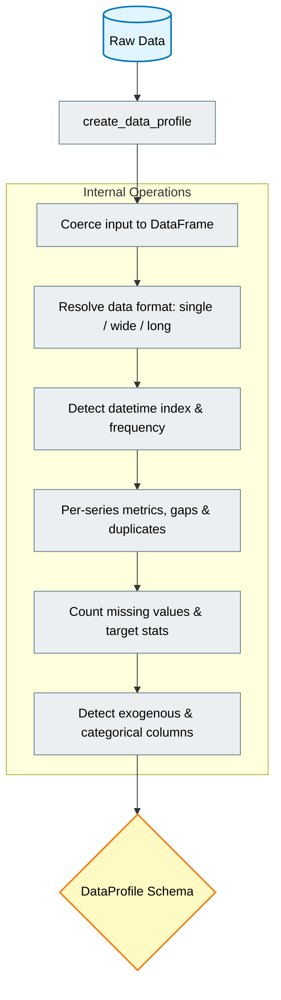
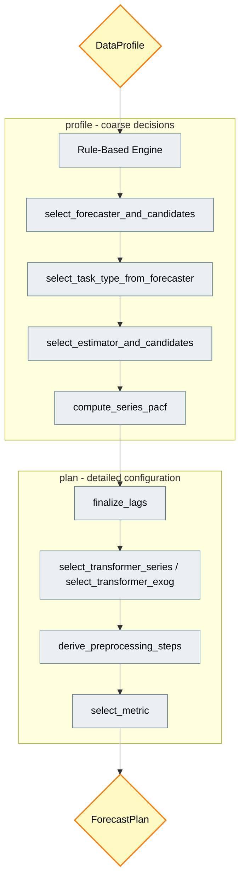
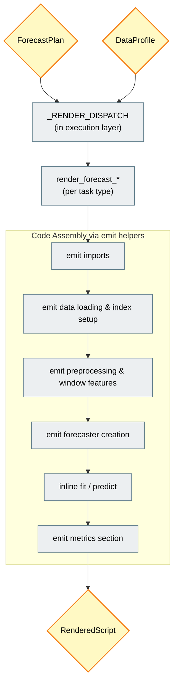
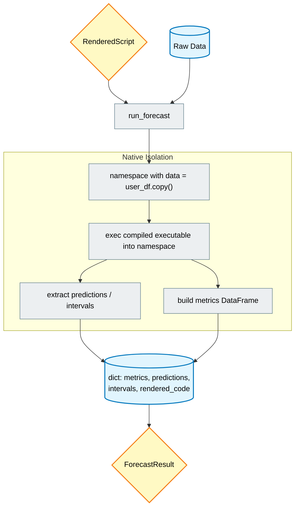
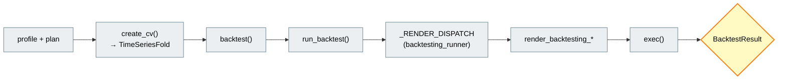
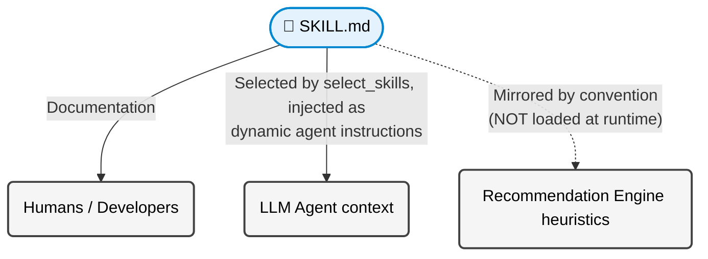

# Architecture & Logic

**skforecast-ai** separates *execution* from *reasoning*. This design keeps all forecasting results deterministic, testable, and reproducible, while leveraging the analytical and diagnostic power of Large Language Models (LLMs) to guide the user as a reasoning engine.

This guide details the internal structure, the state transformations within the forecasting pipeline, and the "Knowledge as Code" pattern that grounds the LLM.

---

## 1. High-Level Architecture

At its core, `skforecast-ai` operates as a rule-based inference engine. The LLM does not generate code on its own; instead, it acts strictly as an *observer* and *explainer* of the deterministic pipeline.

> **Note:** The LLM reasoning layer is entirely optional. When no LLM is configured the boxes on the right are inert: profiling, recommendation, rendering, and execution all run without them.

### Modes of Operation
*   **Deterministic Mode (Default, called "Tier 0" internally):** Runs the pipeline from profiling to execution. It generates deterministic `skforecast` code and predictions without requiring an internet connection or an API key. All methods except `ask()` work in this mode.
*   **LLM Mode:** Activated when an LLM provider is configured via the `llm="provider:model"` string (e.g. `ForecastingAssistant(llm="openai:gpt-4o-mini")`). The assistant reads the internal pipeline state (e.g. understanding *why* an `LGBMRegressor` was chosen over `Ridge`) and communicates this to the user via the `.ask()` interface. Calling `ask()` without a configured LLM raises `LLMRequiredError`.

**Supported providers** (parsed by `skforecast_ai/llm/provider.py`): `openai`, `google`, `anthropic`, `groq`, and `ollama`. Any other prefix is treated as an OpenAI-compatible endpoint (configurable via `base_url`). The model string is always `provider:model_name`; the colon split means model names may themselves contain colons (e.g. `ollama:qwen2.5:7b-instruct`).

> **Privacy:** By default the assistant does **not** send your raw data to the LLM. Set `send_data_to_llm=True` on the constructor to opt in.

---

## 2. The Forecasting Pipeline

The deterministic core follows a strictly functional pipeline design. Data flows sequentially through discrete stages, with each stage applying pure functions to transform one `pydantic` schema into the next. The schemas are not frozen, but by convention they are treated as immutable and passed forward unchanged.

> The execution **runner** (`run_forecast`) returns a plain `dict`. The typed `ForecastResult` schema is assembled one level up, inside `ForecastingAssistant.forecast()`.

### Stage 1: Profiling (`skforecast_ai.profiling`)

The pipeline begins by inspecting the raw user dataset. This stage acts as a robust data validator and metadata extractor. It **does not** fit any models or analyze statistical target relationships; its sole purpose is to understand the structure and limitations of the input data. The single public entry point is `create_data_profile()` (`skforecast_ai/profiling/data_profile.py`).

**Key Operations** (helper functions in `profiling/data_profile.py` unless noted):
- **Input coercion:** Accepts a DataFrame, CSV path, or `Path`, normalized by `_coerce_to_dataframe` (defined in `skforecast_ai/_utils.py`, not in the profiling module).
- **Format resolution:** `_resolve_data_format` classifies the dataset as `single`, `wide`, or `long`.
- **Index analysis:** `infer_frequency` detects the frequency (e.g. daily, monthly); `_check_monotonic`, `_check_frequency_is_set`, `detect_gaps`, and `detect_duplicate_timestamps` validate index integrity.
- **Missing values tracking:** `count_missing_values` locates `NaN`s in the target and exogenous columns. Their presence heavily dictates which downstream preprocessing steps or estimators are viable.
- **Series & target metrics:** `_compute_series_metrics` measures per-series lengths; `compute_target_stats` and `detect_target_dtype` summarize the target; `detect_exog_columns` / `detect_categorical_exog` identify covariates.
- **Output:** A strongly typed `DataProfile` object (`schemas/profiles.py`). This schema is the structural ground truth about the dataset for the rest of the pipeline.

> **Important distinction:** `ForecastingAssistant.profile()` returns a **`ForecastingProfile`**, not a bare `DataProfile`. `ForecastingProfile` wraps the `DataProfile` (as `.data_profile`) and adds the *coarse* modeling decisions made at profile time: `task_type`, the selected `forecaster` and `estimator`, their ordered candidate lists, per-series PACF lags (`series_pacf`), and window features. See §6.

### Stage 2: Recommendation (`skforecast_ai.recommendation`)

This is the core of the deterministic engine. Using a series of hardcoded, sequential business rules, it evaluates the profile to determine the forecasting architecture. This heuristic approach intentionally avoids the "black box" nature of traditional AutoML. The logic is split across `forecaster_selection.py`, `autoregressive.py`, `preprocessing.py`, and `metric_selection.py`, and is orchestrated across the assistant's `profile()` and `plan()` methods.

**Key Operations:**
- **Forecaster resolution** (`select_forecaster_and_candidates`): the forecaster family is chosen from the profile. When more than one series is present the preferred class is `ForecasterRecursiveMultiSeries` (candidate: `ForecasterDirectMultiVariate`); for a single series the preferred class is `ForecasterRecursive` (candidates: `ForecasterDirect`, `ForecasterFoundation`, `ForecasterStats`).
- **Task resolution** (`select_task_type_from_forecaster`): the chosen forecaster maps deterministically to one of five task types via a fixed dictionary (see table below).
- **Estimator selection** (`select_estimator_and_candidates`): For `statistical` tasks the estimator is `Arima`; for `foundation` tasks it is `Chronos-2`. For the regression-based tasks the rule is observation-count driven: **fewer than 250 observations → `Ridge`** (to prevent overfitting), **≥ 250 → `LGBMRegressor`**, each with an ordered candidate list (small data: `Ridge, RandomForestRegressor, LGBMRegressor`; larger: `LGBMRegressor, XGBRegressor, Ridge`).
- **Lag & feature derivation:** PACF-significant lags are computed per series at profile time (`compute_series_pacf`) and aggregated into a final lag set during planning (`finalize_lags`).
- **Preprocessing:** transformers and NaN handling are chosen (`select_transformer_series`, `select_transformer_exog`, `select_dropna_from_series`) and assembled by `derive_preprocessing_steps`; `select_metric` picks the evaluation metric.
- **Output:** A `ForecastPlan` object (`schemas/plans.py`), which is a comprehensive, declarative blueprint detailing exactly *how* the forecast will be executed, independent of any actual Python code.

**Task type → forecaster → estimator.** The identifiers below are those used by `select_task_type_from_forecaster` and emitted by the rendering layer. The authoritative mapping lives in [`recommendation/forecaster_selection.py`](../api/recommendation/forecaster_selection.md); treat the code, not this table, as ground truth if they ever diverge.

| Task type | Forecaster class (as imported by the generated script) | Default estimator |
| --- | --- | --- |
| `single_series` | `ForecasterRecursive` (preferred) / `ForecasterDirect` | `Ridge` (< 250 obs) / `LGBMRegressor` (≥ 250) |
| `multi_series` | `ForecasterRecursiveMultiSeries` | `Ridge` (< 250 obs) / `LGBMRegressor` (≥ 250) |
| `multivariate` | `ForecasterDirectMultiVariate` | `Ridge` (< 250 obs) / `LGBMRegressor` (≥ 250) |
| `statistical` | `ForecasterStats` (imported from `skforecast.recursive`) | `Arima` (from `skforecast.stats`; no external estimator) |
| `foundation` | `ForecasterFoundation` (from `skforecast.foundation`) | `Chronos-2` (no external estimator) |

> The first four forecasters are standard `skforecast` classes. `ForecasterStats` and `ForecasterFoundation` are version-dependent: the generated `statistical`/`foundation` scripts will only run if the installed `skforecast` exposes them at the import paths shown above.

### Stage 3: Rendering (`skforecast_ai.rendering`)

The rendering layer is a dynamic code generator. It translates the abstract `ForecastPlan` (plus the `DataProfile`) into a concrete, human-readable Python script, ensuring the user can audit, modify, or independently deploy the code. There is one render function per task type (exported from `rendering/__init__.py`):

`render_forecast_single_series`, `render_forecast_multi_series`, `render_forecast_multivariate`, `render_forecast_statistical`, `render_forecast_foundation`.

Dispatch by task type does **not** live in the rendering package; it lives in the **execution** layer, in a `_RENDER_DISPATCH` dict (`execution/forecast_runner.py`) that maps each `task_type` to the appropriate render function. (Backtesting has its own parallel dispatch; see §3.)

**Key Operations:**
- **Code Assembly:** Each `render_forecast_*` builds the script line-by-line via specialized emit helpers. Shared helpers live in `rendering/_helpers.py` (e.g. `_emit_data_loading`, `_emit_index_setup`, `_emit_preprocessing_steps`, `_emit_window_features`, `_emit_transformer_exog`, `_emit_metrics_section*`). Import and forecaster-creation helpers are **per task type**: `_emit_imports_single_series` / `_multi_series` / `_foundation` / `_statistical`, and `_emit_forecaster_creation_single` / `_multi` / `_foundation` / `_statistical`. There is no single `_emit_imports`/`_emit_forecaster_creation`, and no `_emit_fit_and_predict` (the fit/predict logic is emitted inline inside each `render_forecast_*` function).
- **Formatting:** `_emit_aligned_kwargs` applies alignment rules so the generated script is not just executable, but idiomatic and visually structured.
- **Output:** A `RenderedScript` object (`schemas/results.py`) with three string fields (`imports`, `data_loading`, and `core`) plus two convenience properties: `full_script` (`imports + data_loading + core`, the standalone script returned by `forecast_code()`) and `executable` (`imports + core`, no CSV loading: this is what `exec()` runs).

### Stage 4: Execution (`skforecast_ai.execution`)

To guarantee absolute fidelity (the code shown to the user is *exactly* the code generating the results), `skforecast-ai` compiles and executes the `RenderedScript.executable` string using Python's native `exec()` within an isolated namespace (`execution/forecast_runner.py`, helper `_exec_rendered_code`).

**Key Operations:**
- **Environment Setup:** Loads a copy of the user's `pandas.DataFrame` directly into the namespace under the key `"data"` (`namespace = {"data": data.copy()}`). This avoids disk I/O (writing temporary CSVs) during execution. `stdout` from the generated code is captured.
- **Error handling:** If the generated code raises, it is wrapped in `ForecastExecutionError`, which carries both the `generated_code` and the full `execution_traceback` for debugging.
- **State Extraction:** After execution, the runner pulls predictions, optional intervals, and metric values out of the namespace and assembles a metrics DataFrame (columns like `series, MAE, MSE, MASE`).
- **Output:** `run_forecast` returns a plain **`dict`** with keys `metrics`, `predictions`, `intervals`, and `rendered_code` (the `RenderedScript` object, not a string). `ForecastingAssistant.forecast()` then wraps this dict into the typed `ForecastResult` schema, exposing `.code` via `rendered_code.full_script`.

---

## 3. Backtesting

Alongside the single-shot forecast pipeline, the assistant supports time-series **backtesting** (walk-forward evaluation). It reuses the same profiling and recommendation stages, but renders and executes a backtesting script driven by a `skforecast` `TimeSeriesFold`.

**Key elements:**
- **`create_cv()`** (`assistant.py`) builds a `TimeSeriesFold` (initial train size, fold stride, refit policy, gap, etc.) and returns it together with a human-readable explanation. When an LLM is configured it can assist in choosing the parameters.
- **`backtest_code()`** generates the standalone backtesting script; **`backtest()`** executes it end-to-end and returns a `BacktestResult`.
- **`run_backtest()`** (`execution/backtesting_runner.py`) mirrors `run_forecast`: it has its own `_RENDER_DISPATCH` mapping task types to `render_backtesting_single_series` / `_multi_series` / `_multivariate` / `_statistical` / `_foundation` (from `rendering/backtesting.py`), execs the rendered code, and returns a `dict` with keys `metrics`, `predictions`, `rendered_code`, and `explanation`.
- **`BacktestResult`** (`schemas/results.py`) wraps that output and additionally records the resolved `cv_config` for traceability.

---

## 4. "Knowledge as Code" (Skills)

A critical challenge in AI assistants is keeping the LLM's explanations consistent with the codebase's logic. If the recommendation engine applies one rule but the LLM explains another from outdated pre-training data, user trust erodes.

`skforecast-ai` addresses this with the **Knowledge as Code** pattern. Best practices and heuristic thresholds are written up as isolated Markdown files called **Skills**, located in `skforecast_ai/skills/`. There are **16 skills**, each a directory containing a `SKILL.md` (plus an optional `references/` subdirectory). The inventory is enumerated in `ALL_SKILLS` (`skforecast_ai/llm/skills.py`): `autocorrelation-and-lag-selection`, `backtesting-configuration`, `choosing-a-forecaster`, `complete-api-reference`, `deep-learning-forecasting`, `drift-detection`, `feature-engineering`, `feature-selection`, `forecasting-multiple-series`, `forecasting-single-series`, `foundation-forecasting`, `hyperparameter-optimization`, `metric-selection`, `prediction-intervals`, `statistical-models`, `troubleshooting-common-errors`.

### How skills reach the LLM
Skill selection is **rule-based**, not embedding/vector retrieval (`skforecast_ai/llm/skills.py`):
1. **Task-type routing:** `select_skills()` looks up base skills for the profile's `task_type` via the `_TASK_TYPE_SKILLS` table.
2. **Keyword augmentation:** the user's question is scanned against the `_KEYWORD_SKILLS` regex list (intervals, backtesting, hyperparameters, lags, metrics, etc.) to append relevant skills.
3. **Conflict resolution & budgeting:** `_SKILL_OVERRIDES` removes contradictory skills (e.g. foundation models suppress lag/feature skills), and the set is trimmed to a token budget.
4. **Injection:** the selected files are read by `load_skill()` and injected into the agent's **dynamic instructions** at call time (`skforecast_ai/llm/agent.py`). The skforecast API reference (`resources/llms-base.txt`) is optionally added via `include_reference=True`.

### Relationship to the recommendation engine
The deterministic recommendation engine does **not** read `SKILL.md` files at runtime. The heuristics are hardcoded in Python (`skforecast_ai/recommendation/`), and the skill documents *mirror* that logic by convention. The recommendation modules cite their corresponding skill in docstrings (e.g. *"Source: `skforecast_ai/skills/choosing-a-forecaster/SKILL.md`"*). The two are kept in sync manually; editing a `SKILL.md` updates the documentation and the LLM's explanations, but does **not** change engine behavior.

**Architectural Benefits:**
1. **Two synchronized sources of truth:** the Python heuristics and the skill docs describe the same rules. The convention is to update both together when a best practice changes.
2. **Contextual grounding:** when the user asks the LLM a question (e.g. *"Why Ridge instead of XGBoost?"*), the agent reads the relevant skill to ground its answer in `skforecast`'s actual rules, reducing hallucination.
3. **Transparency:** users can browse `skforecast_ai/skills/` on GitHub to see exactly the rules the assistant is bound by.

---

## 5. The LLM Layer (`skforecast_ai.llm`)

The optional LLM layer is isolated in its own package so the deterministic core never depends on it. Built on **Pydantic AI**:

| Module | Responsibility |
| --- | --- |
| `provider.py` | Parse `provider:model` strings (`parse_model_string`) and build the Pydantic AI model (`create_model`). Handles `openai` (pinned to the Chat Completions API via an `openai-chat:` prefix), `google`, `anthropic`, `groq`, `ollama`, and OpenAI-compatible fallbacks. |
| `skills.py` | Skill inventory, `load_skill`, `select_skills`, token budgeting, and the API-reference loader. |
| `agent.py` | Create the Pydantic AI agent (`create_forecasting_agent`) with static role instructions plus dynamic, per-call skill instructions. |
| `prompts.py` | Static prompt/role text. |
| `context.py` | Builds the context (profile/plan/results) passed to the agent. |

When `llm=None`, none of this is exercised, and the assistant stays in Tier 0 (deterministic) mode.

---

## 6. Public API & Schemas

### `ForecastingAssistant` methods (`skforecast_ai/assistant.py`)

| Method | Returns | Purpose |
| --- | --- | --- |
| `__init__(llm=None, base_url=None, api_key=None, send_data_to_llm=False)` | N/A | Configure the assistant; `llm=None` ⇒ deterministic mode. |
| `profile(...)` | `ForecastingProfile` | Stage 1 + coarse decisions (forecaster, estimator, candidates, task type, PACF lags). |
| `plan(...)` | `ForecastPlan` | Stage 2 detailed configuration (lags, metric, transformers, intervals, preprocessing). |
| `refine_plan(...)` | `ForecastPlan` | Apply user overrides to an existing plan. |
| `forecast_code(...)` | `CodeGenerationResult` | Stage 3: generate the standalone Python script. |
| `forecast(...)` | `ForecastResult` | Full pipeline: profile → plan → render → exec. |
| `create_cv(...)` | `(TimeSeriesFold, str)` | Build a CV fold splitter (+ explanation). |
| `backtest_code(...)` | `CodeGenerationResult` | Generate the backtesting script. |
| `backtest(...)` | `BacktestResult` | Execute the backtesting workflow. |
| `ask(...)` | `AskResult` | LLM Q&A grounded in pipeline state + skills (requires an LLM). |

### Schemas (`skforecast_ai/schemas/`)
All are `pydantic.BaseModel`s (not frozen):
- **`DataProfile`** (`profiles.py`): structural facts about the dataset.
- **`ForecastingProfile`** (`profiles.py`): wraps a `DataProfile` plus coarse modeling decisions; returned by `profile()`.
- **`ForecastPlan`** (`plans.py`): the full declarative execution blueprint.
- **`RenderedScript`** (`results.py`): `imports` / `data_loading` / `core` sections + `full_script` / `executable` properties.
- **`CodeGenerationResult`**, **`AskResult`**, **`ForecastResult`**, **`BacktestResult`** (`results.py`): the typed outputs of the corresponding workflows.

---

## 7. CLI, Configuration & Errors

### CLI (`skforecast_ai/cli.py`)
A Typer-based command-line interface mirrors the programmatic API. Commands: `profile`, `plan`, `refine-plan`, `forecast-code`, `backtest-code`, `forecast`, `backtest`, and `ask`, plus a `config` sub-group (`show` / `set` / `path`).

### Configuration (`skforecast_ai/config.py`)
Persistent settings live in a TOML file at `~/.config/skforecast-ai/config.toml` (honoring `XDG_CONFIG_HOME`). Recognized keys (`VALID_KEYS`): `llm.provider`, `llm.base_url`, `llm.api_key`, `llm.send_data_to_llm`, `output.format`. The file is written with `0o600` permissions since it may hold an API key.

### Exceptions (`skforecast_ai/exceptions.py`)
- **`LLMRequiredError`**: raised when an LLM-only method (e.g. `ask()`) is called without a configured LLM.
- **`ForecastExecutionError`**: raised when the generated code fails inside `exec()`; exposes `original_error`, `generated_code`, and `execution_traceback` for debugging.

> The `skforecast_ai/generation/` directory currently contains no active Python modules and is not part of the runtime pipeline.

