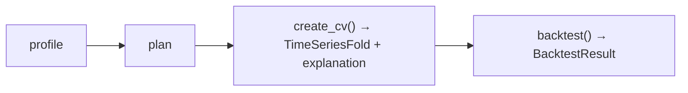

# Backtesting & validation

A single train/test split tells you how a model did on *one* slice of the future. **Backtesting** (walk-forward validation) tells you how it does *repeatedly*, across many points in time — which is the honest way to estimate how a forecast will perform in production.

skforecast-ai backtests with the same profile and plan it uses for forecasting, so you're evaluating the exact model you'd deploy.

## The backtesting workflow



```python
from skforecast_ai import ForecastingAssistant

assistant = ForecastingAssistant()

# 1. Profile and plan as usual
profile = assistant.profile(data, target="y", date_column="date")
plan    = assistant.plan(profile, steps=12)

# 2. Build a cross-validation strategy (with sensible defaults)
cv, cv_explanation = assistant.create_cv(profile, plan)
print(cv_explanation)

# 3. Run the walk-forward evaluation
result = assistant.backtest(
    data=data,
    target="y",
    date_column="date",
    cv=cv,
    profile=profile,
    plan=plan,
)
```

## Configuring the cross-validation

`create_cv()` returns a configured `TimeSeriesFold` (skforecast's fold splitter) plus a plain-language `explanation` of the choices. With no arguments it derives sensible defaults from your data; override any of these to match how you actually deploy:

| Parameter | Meaning |
| --- | --- |
| `initial_train_size` | Observations for the first training set. An `int` (count), a `float` in (0, 1) (fraction), or a date string. |
| `refit` | Refit every fold (`True`), never (`False`), or every *n* folds (`int`). |
| `fixed_train_size` | `True` = rolling window (old data dropped); `False` = expanding window (all history kept). |
| `gap` | Observations between the end of training and the start of the test set — models a real-world delay. |
| `fold_stride` | Distance between consecutive test sets. `None` means equal to `steps` (non-overlapping folds). |
| `skip_folds` | Skip folds to save compute (`int` keeps every *n*-th; a list gives indexes to skip). |
| `allow_incomplete_fold` | Whether a final, shorter-than-`steps` fold is allowed. |

```python
# Example: simulate "retrain weekly, with a 1-day data delay, keep all history"
cv, explanation = assistant.create_cv(
    profile, plan,
    refit=7,
    gap=1,
    fixed_train_size=False,
)
```

!!! tip "Match the configuration to your deployment"
    The most useful backtest reproduces your real operating conditions. Retrain monthly? Set `refit` accordingly. Forecasts needed two days ahead of data availability? Set `gap=2`. The closer the configuration matches production, the more trustworthy the metrics.

## Reading the result

`backtest()` returns a `BacktestResult`:

| Attribute | What it holds |
| --- | --- |
| `result.metrics` | Backtest metrics across all folds (DataFrame). |
| `result.predictions` | The full set of out-of-sample predictions over every fold. |
| `result.cv_config` | The resolved `TimeSeriesFold` parameters that were used — kept for traceability. |
| `result.code` | The standalone Python script reproducing the entire backtest. |
| `result.explanation` | Human-readable summary of the configuration and results. |
| `result.profile` / `result.plan` | The profile and plan that were evaluated. |

```python
print(result.metrics)
print(result.cv_config)     # exactly which folds were run
print(result.explanation)
```

## Just the script, please

To get the backtesting script **without** executing it — to audit it or run it elsewhere — use `backtest_code()` instead of `backtest()`. It takes the same arguments and returns a `CodeGenerationResult` whose `.code` is the standalone script. See [Reproducible code](reproducible-code.md).

```python
generated = assistant.backtest_code(data, target="y", date_column="date", cv=cv,
                                    profile=profile, plan=plan)
print(generated.code)
```

## Letting the LLM configure the folds *(optional)*

If you have [an LLM configured](using-the-ai-assistant.md), you can describe your evaluation scenario in words and let it translate that into fold parameters via the `prompt` argument:

```python
assistant = ForecastingAssistant(llm="openai:gpt-4o-mini")
cv, explanation = assistant.create_cv(
    profile, plan,
    prompt="I retrain every Monday and need forecasts for the next 7 days.",
)
```

Without an LLM, `prompt` raises `LLMRequiredError`; the deterministic defaults and explicit keyword arguments above cover everything you need in the default mode.

## Next steps

- **[Customizing the model](customizing-the-model.md)** — backtest different models and compare their metrics.
- **[Reproducible code](reproducible-code.md)** — export and deploy the validated pipeline.
- **[Troubleshooting](troubleshooting.md)** — if a backtest raises an error (e.g. not enough data for two folds).
