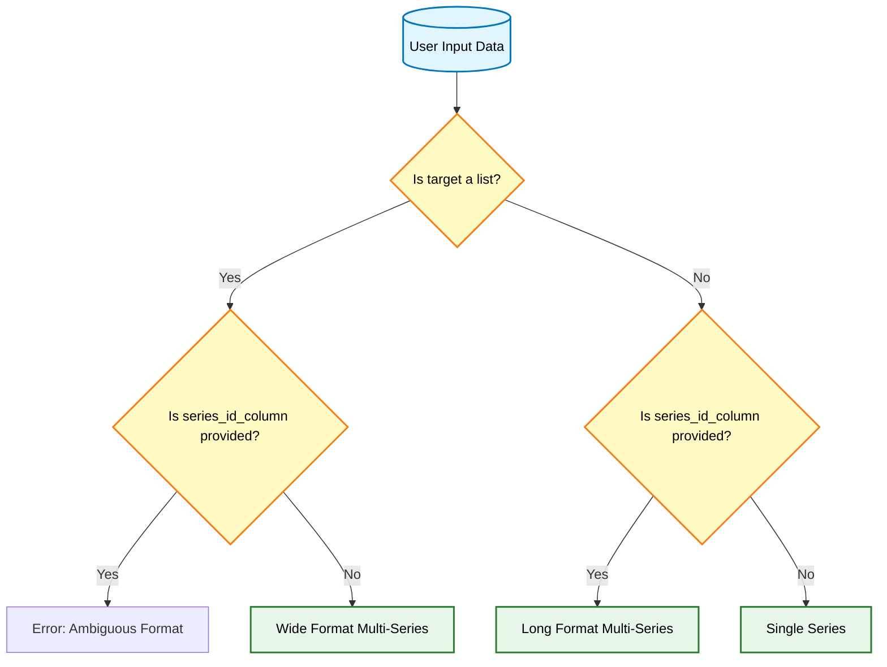
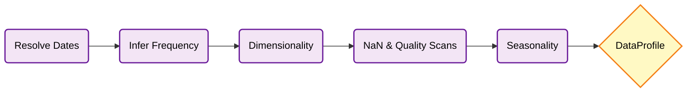
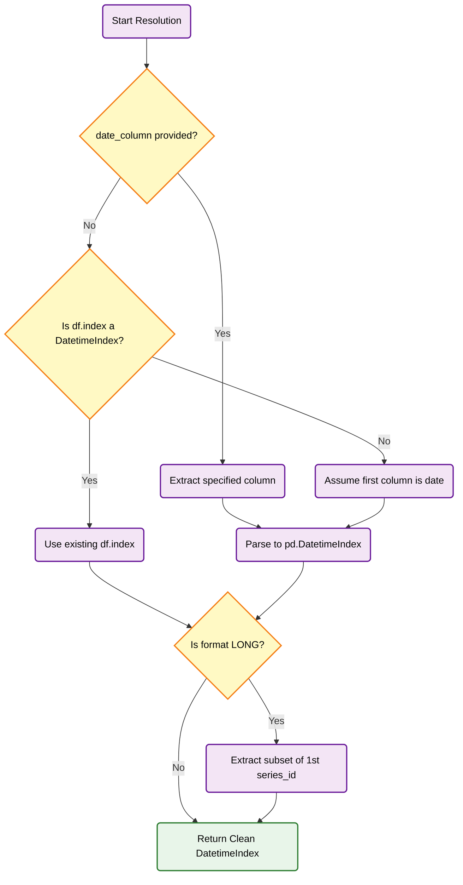

# Stage 1: Data Profiling

The **Data Profiling** stage is the first and arguably most critical step in the `skforecast-ai` pipeline. Before any forecasting logic is generated, the assistant must exhaustively understand the shape, quality, and limitations of the data provided by the user.

Unlike traditional AutoML libraries that silently drop rows or impute values, the Data Profiling stage in `skforecast-ai` acts as an **immutable metadata extractor**. It inspects the `pandas.DataFrame` and returns a strictly typed `DataProfile` object. This schema acts as the single source of truth for all downstream decisions.

---

## 1. What Happens During Profiling?

When the user calls `assistant.profile(data, target=...)` or initiates a full `.forecast()` workflow, the core engine triggers `skforecast_ai.profiling.create_data_profile`.

This function performs a sequential set of validations and extractions without actually fitting any statistical models.

### Step 1: Input Resolution and Formatting
`skforecast-ai` seamlessly handles multiple input formats. It first resolves how the data is structured:



* **Single Series:** A standard DataFrame with a datetime index or date column, and one target column.
* **Wide Format (Multi-Series):** A DataFrame where multiple columns act as independent target series sharing a common time index.
* **Long Format (Multi-Series):** A DataFrame where series are stacked vertically, distinguished by a `series_id_column`.

### Metadata Extraction Pipeline

Once the format is resolved, the profiler extracts metadata sequentially:



### Step 2: Temporal Index Inference
Time series forecasting relies heavily on the temporal axis. The profiler must extract a pristine `DatetimeIndex` to perform quality checks, even if the raw data comes as loosely formatted strings in a CSV.

#### Date Resolution Logic (`_extract_datetime_index`)

The engine uses a fallback mechanism to robustly locate and format the temporal data:



1. **Locates the Date Column:** Follows the logic above to find the temporal data.
2. **Long Format Handling:** If the data is stacked (Long Format), checking frequency on the whole column fails because dates repeat for every series. The engine smartly isolates the first unique `series_id` and extracts its specific timeline to perform the frequency analysis.
3. **Infers Frequency:** Analyzes the time deltas between rows (`pd.infer_freq`) to infer the Pandas frequency string (e.g., `'D'` for daily, `'MS'` for month-start).
4. **Checks Monotonicity:** Ensures time always moves forward without jumping back.
5. **Detects Duplicates:** Flags if multiple observations exist for the exact same timestamp. If duplicates exist, it attempts to deduplicate temporarily just to successfully infer the base frequency.

### Step 3: Dimensionality and Quality Checks
The profiler scans the actual data columns:
1. **Target Identification:** Locates the target variable(s) and determines their data type (numeric, categorical).
2. **Missing Values (`NaN`):** Exhaustively counts missing values in the target series and exogenous variables. The presence of NaNs directly impacts which estimators (e.g., `HistGradientBoostingRegressor` vs. `Ridge`) or preprocessing pipelines are recommended later.
3. **Exogenous Variables:** Any column that is not the target, the date, or the series ID is automatically classified as an exogenous (predictor) variable. The profiler checks if these are numeric or categorical.
4. **Constant Check:** Validates that the target series actually has variance. A perfectly flat series will trigger an immediate, informative error.

### Step 4: Seasonality Heuristics
Based on the inferred frequency from Step 2, the profiler estimates likely seasonal periods using a heuristic mapping. For instance, if the frequency is `'h'` (hourly), it suggests seasonalities of `[24, 168]` (daily and weekly cycles).

---

## 2. The `DataProfile` Schema

The output of the profiling stage is a `DataProfile` Pydantic model. This object is immutable and is passed to the Recommendation Engine in Stage 2.

Here is an example of what the `DataProfile` might look like internally for a daily dataset with missing values:

```json
{
  "task_type": "single_series",
  "data_format": "single",
  "target": "sales",
  "target_dtype": "numeric",
  "n_series": 1,
  "n_observations": 1460,
  "series_lengths": {"sales": 1460},
  "index_type": "datetime",
  "frequency": "D",
  "frequency_is_set": true,
  "index_is_monotonic": true,
  "has_duplicate_timestamps": false,
  "has_gaps": false,
  "exog_columns": ["temperature", "holiday"],
  "categorical_exog": ["holiday"],
  "missing_target": 12,
  "missing_exog": 0,
  "estimated_seasonalities": [7, 365],
  "warnings": [
    "Target column 'sales' contains missing values (NaNs)."
  ]
}
```

---

## 3. Forecaster-Specific Analysis (`ForecastingAnalysis`)

While the `DataProfile` acts as the universal ground truth, different forecasting algorithms care about different things. Before passing the data to the LLM or finalizing hyperparameters, the system runs an *optional* sub-stage: `create_forecasting_analysis`.

Once the Recommendation Engine (Stage 2) decides *which* model to use (e.g., `ForecasterRecursiveMultiSeries`), the Analysis stage computes extra metrics tailored to that specific forecaster:

* **For Multi-Series (`_analyze_multi_series`):** It calculates the length of the shortest and longest series, determining if some series are too short (`< 50` observations) to train reliable lags.
* **For Single-Series ML (`_analyze_single_ml`):** It extracts the series variance to help determine if scaling is strictly necessary.

This specialized context (`ForecastingAnalysis`) is heavily utilized by the LLM Overlay to provide highly nuanced answers when the user asks, *"Why did you limit the lags to 14?"*

---

## 4. Why This Matters

By rigorously profiling the data *before* taking any action, `skforecast-ai` achieves three things:
1. **Fail Fast:** If the data is fundamentally broken (e.g., non-monotonic dates, constant target), it stops immediately with a clear error.
2. **Deterministic Routing:** The presence of NaNs, the frequency, and the data format deterministically lock in the safest path forward in the Recommendation engine.
3. **LLM Context:** The LLM does not need to look at raw rows of data (which is token-heavy and error-prone). It only looks at the pristine `DataProfile` schema, allowing it to reason about the dataset flawlessly.