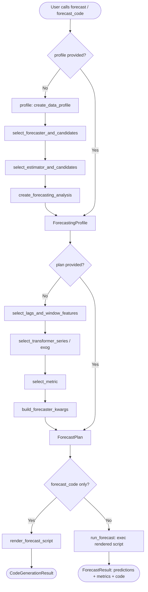
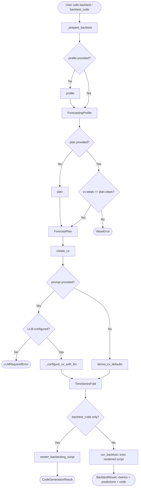
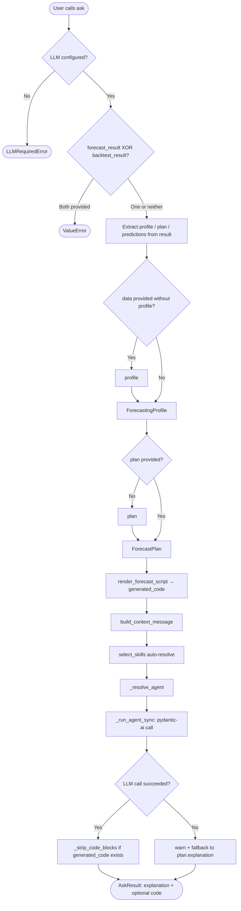

# ForecastingAssistant — Technical Audit Reference

**Module:** `skforecast_ai/assistant.py`  
**Class:** `ForecastingAssistant`  
**License:** Apache License 2.0  
**Audit Scope:** Full class — constructor, public API, private helpers  

---

## 1. Overview & Purpose

`ForecastingAssistant` is the primary orchestration class of the `skforecast-ai` library. It coordinates three independent subsystems — data profiling, deterministic plan derivation, and optional LLM-driven explanation — into a unified forecasting and backtesting pipeline.

### Architectural Position

```
User / CLI
     │
     ▼
ForecastingAssistant          ← this class
     ├── profiling/            deterministic data analysis
     ├── recommendation/       deterministic modeling decisions
     ├── execution/            code rendering + exec()
     └── llm/                  optional LLM layer (explain / Q&A)
```

### Design Invariant

All modeling decisions (forecaster selection, lag derivation, metric choice, CV configuration) are **fully deterministic and reproducible**. The LLM subsystem is architecturally isolated; it adds natural-language explanations and Q&A but **cannot alter any modeling decision**. This separation is the primary auditability guarantee of the class.

### Three Available Workflows

| Workflow | Entry Points | Description |
|---|---|---|
| Fast path | `forecast_code()`, `forecast()` | Single-call end-to-end operation |
| Step-by-step | `profile()` → `plan()` → `refine_plan()` → `forecast_code()` / `forecast()` | Full control at each stage |
| Backtesting | `create_cv()` → `backtest_code()` / `backtest()` | Time-series cross-validation evaluation |

`ask()` is available across all workflows as an LLM-powered Q&A and explanation layer.

---

## 2. Core Logic & Architecture

### 2.1 Execution Flow — Forecast Path



### 2.2 Execution Flow — Backtesting Path



### 2.3 Execution Flow — ask() / LLM Path



### 2.4 Agent Caching Pattern

The class maintains three lazily-initialised cached instances:

| Attribute | Type | Initialised by |
|---|---|---|
| `_model` | Pydantic AI model | `_resolve_model()` |
| `_agent` | `Agent[AskDeps, str]` | `_resolve_agent()` |
| `_cv_agent` | `Agent[CVDeps, CVParams]` | `_resolve_cv_agent()` |

Each is created on first use and reused for subsequent calls, avoiding redundant provider round-trips.

---

## 3. Methods & Subfunctions Inventory

### 3.1 Constructor — `__init__`

**Purpose:** Initialise configuration and reset all cached LLM state.

| Parameter | Type | Default | Description |
|---|---|---|---|
| `llm` | `str \| None` | `None` | Provider string `'provider:model_name'`. None = deterministic-only mode. |
| `base_url` | `str \| None` | `None` | Custom base URL (Ollama or OpenAI-compatible endpoints). |
| `api_key` | `str \| None` | `None` | Explicit API key. When None, Pydantic AI resolves from environment variables. |
| `send_data_to_llm` | `bool` | `False` | Controls whether raw DataFrame rows are included in LLM context. |

**Returns:** `None`

**Edge cases:**
- Passing `api_key` takes precedence over environment-variable resolution; this can be a security risk in shared notebooks — see Section 5.
- `send_data_to_llm=True` permanently enables raw data forwarding; there is no per-call override in the constructor signature (override logic is in `ask()`).

---

### 3.2 `profile()`

**Purpose:** Inspect a dataset and produce the coarse-level modeling recommendation.

| Parameter | Type | Required | Description |
|---|---|---|---|
| `data` | `pd.DataFrame \| str \| Path` | Yes | DataFrame or path to CSV. |
| `target` | `str \| list[str]` | Yes | Column(s) to forecast. Wide-format multi-series = list. |
| `date_column` | `str \| None` | No | Timestamp column name. |
| `series_id_column` | `str \| None` | No | Series identifier column (long-format multi-series). |

**Returns:** `ForecastingProfile`

| Field | Type | Description |
|---|---|---|
| `data_profile` | `DataProfile` | Schema, frequency, missing values, exog columns |
| `task_type` | `str` | `'single_series'`, `'multi_series'`, `'statistical'`, `'foundation'` |
| `forecaster` | `str` | Recommended forecaster class name |
| `forecaster_candidates` | `list[str]` | All compatible forecasters |
| `estimator` | `str` | Recommended estimator class name |
| `estimator_candidates` | `list[str]` | All compatible estimators |
| `analysis_context` | `ForecastingAnalysis` | PACF target series, effective observation count |
| `explanation` | `str` | Human-readable decision summary |

**Internal call chain:**

```
_coerce_to_dataframe → create_data_profile
→ select_forecaster_and_candidates
→ select_task_type_from_forecaster
→ create_forecasting_analysis
→ select_estimator_and_candidates
→ _build_profile_explanation
→ ForecastingProfile
```

**Edge cases:**
- `data_path` defaults to `"data.csv"` for in-memory DataFrames; this is a display-only string for script rendering, not a filesystem path.
- When `data` is a CSV path, the string is preserved and embedded in generated scripts for reproducibility.

---

### 3.3 `plan()`

**Purpose:** Derive the fine-grained forecasting configuration from a profile.

| Parameter | Type | Required | Description |
|---|---|---|---|
| `profile` | `ForecastingProfile` | Yes | Output of `profile()`. |
| `steps` | `int` | Yes | Forecast horizon. |
| `forecaster` | `str \| None` | No | Override forecaster. Must be in `profile.forecaster_candidates`. |
| `estimator` | `str \| None` | No | Override estimator class name. |
| `estimator_kwargs` | `dict \| None` | No | Override estimator constructor kwargs. Merged over built-in defaults. |
| `interval` | `list[int] \| None` | No | `[lower, upper]` percentiles for prediction intervals. |

**Returns:** `ForecastPlan`

| Field | Type | Description |
|---|---|---|
| `task_type` | `str` | Resolved task type |
| `forecaster` | `str` | Resolved forecaster class name |
| `forecaster_kwargs` | `dict` | Full constructor kwargs for the forecaster |
| `estimator` | `str` | Resolved estimator |
| `estimator_kwargs` | `dict` | Estimator constructor kwargs |
| `steps` | `int` | Forecast horizon |
| `frequency` | `str` | Pandas frequency alias |
| `interval` | `list[int] \| None` | Prediction interval bounds |
| `interval_method` | `str \| None` | `'native'` (statistical/foundation) or `'bootstrapping'` |
| `metric` | `str` | Primary evaluation metric |
| `metrics_to_compute` | `list[str]` | All metrics to compute |
| `use_exog` | `bool` | Whether exogenous variables are used |
| `preprocessing_steps` | `list` | Ordered preprocessing transformations |
| `explanation` | `str` | Human-readable plan summary |

**Validation raised:**
- `ValueError` — when `forecaster` override is not in `profile.forecaster_candidates`.

**Edge cases:**
- When `forecaster` override changes the `task_type` (e.g., switching from ML to statistical), `plan()` re-derives `analysis_context` and `estimator`. `target_series` is preserved from the original context if the new context produces `None`.
- For `task_type in ('statistical', 'foundation')`: lags, window features, transformers, and `dropna_from_series` are set to `None` — these fields are not applicable.
- The fallback lag strategy (`n_lags = min(5, max(n_observations // 3, 1))`) activates when `target_series` is empty, guarding against PACF failures on very short or degenerate series.

---

### 3.4 `refine_plan()`

**Purpose:** Produce an updated plan by applying named overrides to an existing plan, without re-profiling.

| Parameter | Type | Required | Description |
|---|---|---|---|
| `profile` | `ForecastingProfile` | Yes | Original profile. |
| `plan` | `ForecastPlan` | Yes | Existing plan to refine. |
| `**overrides` | `dict` | No | Keys: `forecaster`, `estimator`, `estimator_kwargs`, `steps`, `interval`. |

**Returns:** `ForecastPlan`

**Validation raised:**
- `ValueError` — if any override key is not in `{'forecaster', 'estimator', 'estimator_kwargs', 'steps', 'interval'}`.

**Internal logic:** Delegates to `plan()` after merging overrides with existing plan values. No network or LLM calls are made.

---

### 3.5 `forecast_code()`

**Purpose:** Profile, plan, and render a self-contained Python forecasting script in one call.

| Parameter | Type | Required | Description |
|---|---|---|---|
| `data` | `pd.DataFrame \| str \| Path \| None` | Conditional | Required when `profile` is not provided. |
| `target` | `str \| list[str] \| None` | Conditional | Required when `profile` is not provided. |
| `steps` | `int \| None` | Conditional | Required when `plan` is not provided. |
| `date_column` | `str \| None` | No | Timestamp column. |
| `series_id_column` | `str \| None` | No | Series ID column. |
| `forecaster` | `str \| None` | No | Override forecaster. |
| `estimator` | `str \| None` | No | Override estimator. |
| `estimator_kwargs` | `dict \| None` | No | Override estimator kwargs. |
| `interval` | `list[int] \| None` | No | Interval percentiles. |
| `profile` | `ForecastingProfile \| None` | No | Pre-computed profile (skips profiling). |
| `plan` | `ForecastPlan \| None` | No | Pre-computed plan (skips planning). |

**Returns:** `CodeGenerationResult`

| Field | Type | Description |
|---|---|---|
| `profile` | `ForecastingProfile` | Used profile |
| `plan` | `ForecastPlan` | Used plan |
| `code` | `str` | Complete standalone Python script |

**Note:** This method performs **no execution**. The rendered script is a pure string output suitable for saving, reviewing, or manual execution.

---

### 3.6 `forecast()`

**Purpose:** Execute an end-to-end forecasting workflow and return live predictions.

Same parameters as `forecast_code()` plus:

| Parameter | Type | Required | Description |
|---|---|---|---|
| `exog_future` | `pd.DataFrame \| None` | No | Exogenous variables covering the forecast horizon (`steps` rows). When absent and exog is present, the last `steps` rows of training exog are used. |

**Returns:** `ForecastResult`

| Field | Type | Description |
|---|---|---|
| `profile` | `ForecastingProfile` | Used profile |
| `plan` | `ForecastPlan` | Used plan |
| `code` | `str` | Script whose execution produced the results |
| `metrics` | `pd.DataFrame` | MAE, MSE, MASE per series |
| `predictions` | `pd.DataFrame` | Forecasted values |
| `intervals` | `pd.DataFrame \| None` | Prediction interval bounds (if requested) |

**Fidelity guarantee:** The `code` field reproduces the exact execution path, ensuring the returned predictions are independently verifiable from the returned script.

---

### 3.7 `create_cv()`

**Purpose:** Generate a `TimeSeriesFold` cross-validation strategy for backtesting.

| Parameter | Type | Required | Description |
|---|---|---|---|
| `profile` | `ForecastingProfile` | Yes | Dataset profile. |
| `plan` | `ForecastPlan` | Yes | Forecast plan. |
| `prompt` | `str \| None` | No | Natural-language deployment scenario (requires LLM). |
| `initial_train_size` | `int \| str \| pd.Timestamp \| None` | No | Override initial training window. |
| `fold_stride` | `int \| None` | No | Test-set advance between folds. |
| `refit` | `bool \| int \| None` | No | Refit behaviour. |
| `fixed_train_size` | `bool \| None` | No | Fixed vs. expanding window. |
| `gap` | `int \| None` | No | Gap between train end and test start. |
| `skip_folds` | `int \| list[int] \| None` | No | Folds to skip. |
| `allow_incomplete_fold` | `bool \| None` | No | Allow the last fold to be shorter than `steps`. |

**Returns:** `tuple[TimeSeriesFold, str]` — configured CV splitter and human-readable explanation.

**Validation raised:**
- `LLMRequiredError` — when `prompt` is provided but `self.llm is None`.
- `ValueError` — when `initial_train_size` is a float outside `(0, 1)`.
- `ValueError` — when the resolved CV configuration yields fewer than 2 folds (skip validation is applied when `initial_train_size` is a date string).

**LLM path:** `_configure_cv_with_llm()` is called with up to 2 retries. If all attempts fail, deterministic defaults are applied and a `UserWarning` is emitted — no exception propagates to the caller.

---

### 3.8 `backtest_code()`

**Purpose:** Profile, plan, and render a self-contained backtesting script without execution.

| Parameter | Type | Required | Description |
|---|---|---|---|
| `data` | `pd.DataFrame \| str \| Path` | Yes | Dataset. |
| `target` | `str \| list[str]` | Yes | Target column(s). |
| `cv` | `TimeSeriesFold` | Yes | CV splitter (from `create_cv()` or user-constructed). |
| `date_column` | `str \| None` | No | Timestamp column. |
| `series_id_column` | `str \| None` | No | Series ID column. |
| `forecaster` | `str \| None` | No | Override forecaster. |
| `estimator` | `str \| None` | No | Override estimator. |
| `estimator_kwargs` | `dict \| None` | No | Override estimator kwargs. |
| `interval` | `list[int] \| None` | No | Interval percentiles. |
| `profile` | `ForecastingProfile \| None` | No | Pre-computed profile. |
| `plan` | `ForecastPlan \| None` | No | Pre-computed plan. |

**Returns:** `CodeGenerationResult`

Delegates preparation to `_prepare_backtest()`, then calls `render_backtesting_script()`.

---

### 3.9 `backtest()`

**Purpose:** Execute backtesting end-to-end using the provided CV strategy.

Same parameters as `backtest_code()` plus:

| Parameter | Type | Default | Description |
|---|---|---|---|
| `show_progress` | `bool` | `True` | Display tqdm progress bar during execution. |

**Returns:** `BacktestResult`

| Field | Type | Description |
|---|---|---|
| `profile` | `ForecastingProfile` | Used profile |
| `plan` | `ForecastPlan` | Used plan |
| `cv_config` | `dict` | Resolved `TimeSeriesFold` parameters |
| `metrics` | `pd.DataFrame` | Backtest evaluation metrics |
| `predictions` | `pd.DataFrame` | Predictions across all folds |
| `code` | `str` | Reproduced backtesting script |
| `explanation` | `str` | CV and result explanation |

**Date-based `initial_train_size` handling:** When `cv.initial_train_size` is a date string, a synthetic `DatetimeIndex` is constructed from `profile.data_profile.start_date` and `frequency` to perform the fold split. The original string value is then restored on `cv` to ensure script rendering emits a date literal rather than an integer.

---

### 3.10 `ask()`

**Purpose:** LLM-powered Q&A and result explanation. Supports four operating modes.

| Mode | Trigger | LLM Context |
|---|---|---|
| Q&A | No `data`, `profile`, `forecast_result`, or `backtest_result` | Skills only |
| Explain | `data` or `profile` provided | Profile + plan + generated code |
| Results | `forecast_result` provided | Profile + plan + predictions + metrics + intervals |
| Backtest | `backtest_result` provided | Profile + plan + predictions + metrics + CV config |

**Key parameters:**

| Parameter | Type | Description |
|---|---|---|
| `prompt` | `str` | User question or instruction. |
| `data` | `pd.DataFrame \| str \| Path \| None` | Optional data for inline profiling. |
| `target` | `str \| list[str] \| None` | Required when `data` provided. |
| `forecast_result` | `ForecastResult \| None` | Mutually exclusive with `backtest_result`. |
| `backtest_result` | `BacktestResult \| None` | Mutually exclusive with `forecast_result`. |
| `steps` | `int \| None` | Required when `data`/`profile` provided without `plan`. |
| `skills` | `list[str] \| None` | Explicit skill list; None = auto-select. |
| `include_reference` | `bool` | Include skforecast API reference in system prompt. |

**Returns:** `AskResult`

**Error handling:**
- `LLMRequiredError` — raised immediately when `self.llm is None`.
- `ValueError` — raised when both `forecast_result` and `backtest_result` are provided.
- Any LLM call exception is caught, a `UserWarning` is emitted, and the method falls back to `plan.explanation` or the error string. **The exception is never re-raised.**

**Code stripping:** When `generated_code` is present (Explain/Results mode), `_strip_code_blocks()` is applied to the LLM output to remove redundant fenced code blocks from the explanation text.

**Data privacy override:** In Results and Backtest mode, `send_data=True` is forced regardless of `self.send_data_to_llm`, because predictions and metrics must be visible to the LLM to produce meaningful explanations.

---

### 3.11 Private Methods

#### `_prepare_backtest()`

Shared preparation logic for `backtest_code()` and `backtest()`. Coerces input data, triggers profiling and planning when not provided, and validates `cv.steps == plan.steps`.

**Validation raised:** `ValueError` when `cv.steps != plan.steps`.

---

#### `_resolve_model()`

Lazy initialiser for the Pydantic AI model. Creates once and caches in `self._model`. Calls `create_model(llm, base_url, api_key)`.

---

#### `_resolve_agent()`

Lazy initialiser for the main forecasting agent (`Agent[AskDeps, str]`). Calls `create_forecasting_agent(model)`.

---

#### `_resolve_cv_agent()`

Lazy initialiser for the CV configuration agent (`Agent[CVDeps, CVParams]`). Calls `create_cv_agent(model)`.

---

#### `_configure_cv_with_llm()`

Drives the LLM-based CV parameter derivation loop with retry logic.

| Behaviour | Detail |
|---|---|
| Max retries | 2 (3 total attempts) |
| Retry prompt | Previous error and dataset constraints are appended to the original prompt |
| Fallback | `derive_cv_defaults()` with a `UserWarning` after exhausted retries |
| Validation | `_validate_cv_defaults()` called after each LLM response |

**Returns:** `dict` — CV parameter dict in `derive_cv_defaults` format.

---

#### `_validate_cv_defaults()`

Static method. Instantiates a `TimeSeriesFold` from `defaults` and calls `.split()` to verify at least 2 folds are produced.

**Validation raised:** `ValueError` when fewer than 2 folds result.

**Skip condition:** Validation is skipped when `initial_train_size` is a date string (requires actual data index to resolve).

---

#### `_build_ollama_settings()`

Constructs `extra_body` settings for Ollama inference with dynamic `num_ctx` sizing.

| Behaviour | Detail |
|---|---|
| Non-Ollama providers | Returns `None` |
| `num_ctx` formula | `max(4096, min(estimated_tokens + 2048, 32768))` |
| Token estimate | `estimated_prompt_tokens` (system prompt) + `len(user_message) // 4` |
| Warning threshold | Emits `UserWarning` when `estimated_tokens > 30000` |

---

## 4. Dependencies & Integrations

### 4.1 Internal Modules

| Module | Role |
|---|---|
| `skforecast_ai.profiling` | `create_data_profile`, `create_forecasting_analysis` |
| `skforecast_ai.recommendation` | All selection functions (forecaster, estimator, lags, metric, preprocessing, CV defaults, explanations) |
| `skforecast_ai.execution` | `run_forecast`, `run_backtest`, `render_forecast_script`, `render_backtesting_script` |
| `skforecast_ai.llm` | `build_context_message`, `create_model`, `ensure_ollama_reachable`, `estimate_prompt_tokens`, `select_skills`, `AskDeps` |
| `skforecast_ai.llm.agent` | `create_forecasting_agent`, `create_cv_agent`, `CVDeps` |
| `skforecast_ai.schemas` | `AskResult`, `BacktestResult`, `CodeGenerationResult`, `ForecastingProfile`, `ForecastPlan`, `ForecastResult` |
| `skforecast_ai._utils` | `_coerce_to_dataframe`, `_run_agent_sync`, `_strip_code_blocks` |
| `skforecast_ai.exceptions` | `LLMRequiredError` |

### 4.2 External Libraries

| Library | Usage |
|---|---|
| `pandas` | DataFrame handling, date indexing, `TimeSeriesFold.split()` |
| `skforecast.model_selection.TimeSeriesFold` | Cross-validation fold splitter |
| `pydantic_ai` | Agent construction, structured LLM output, model abstraction |
| `warnings` | Non-fatal user warnings for LLM fallbacks and Ollama context sizing |

### 4.3 External Services

| Service | Condition | Privacy Implication |
|---|---|---|
| OpenAI API | When `llm='openai:...'` | Prompt content sent to OpenAI |
| Anthropic API | When `llm='anthropic:...'` | Prompt content sent to Anthropic |
| Google AI API | When `llm='google:...'` | Prompt content sent to Google |
| Ollama (local) | When `llm='ollama:...'` | Local only; no external data transfer |

### 4.4 State Variables

| Attribute | Type | Lifecycle |
|---|---|---|
| `llm` | `str \| None` | Set at init; read-only after construction |
| `base_url` | `str \| None` | Set at init; read-only after construction |
| `api_key` | `str \| None` | Set at init; read-only after construction |
| `send_data_to_llm` | `bool` | Set at init; may be overridden internally by `ask()` in Results mode |
| `_model` | Pydantic AI model \| None | Lazily initialised; cached across calls |
| `_agent` | Agent \| None | Lazily initialised; cached across calls |
| `_cv_agent` | Agent \| None | Lazily initialised; cached across calls |

---

## 5. Audit & Security Considerations

### 5.1 Data Privacy

| Risk | Location | Mitigation |
|---|---|---|
| Raw data sent to external LLM | `ask()` — Results/Backtest mode | `send_data=True` is forced for predictions/metrics; raw training data is **not** sent. In other modes, `send_data_to_llm` governs this. |
| `send_data_to_llm=True` at init | Constructor | When enabled, raw DataFrame content is included in LLM context for all `ask()` calls, including Q&A mode. This is opt-in and defaults to `False`. |
| API key in code | `api_key` parameter | Passing `api_key` explicitly rather than via environment variables risks key exposure in notebooks, logs, and tracebacks. Prefer environment variable resolution (`OPENAI_API_KEY`, etc.). |

### 5.2 Error Handling Summary

| Method | Exception Raised | Exception Caught / Fallback |
|---|---|---|
| `ask()` | `LLMRequiredError`, `ValueError` (mutual exclusion) | All LLM call exceptions → `UserWarning` + deterministic fallback |
| `create_cv()` | `LLMRequiredError`, `ValueError` (float range, < 2 folds) | `_configure_cv_with_llm` retries → `derive_cv_defaults` fallback |
| `plan()` | `ValueError` (invalid forecaster override) | — |
| `refine_plan()` | `ValueError` (invalid override keys) | — |
| `_prepare_backtest()` | `ValueError` (cv.steps ≠ plan.steps) | — |
| `_validate_cv_defaults()` | `ValueError` (< 2 folds) | Caught inside `_configure_cv_with_llm` |

### 5.3 LLM Isolation Guarantee

The LLM layer **cannot** modify the `ForecastingProfile` or `ForecastPlan` objects. Both are Pydantic `BaseModel` instances constructed entirely by deterministic functions. The LLM receives them as read-only context for explanation generation. This is the primary security/reproducibility guarantee of the architecture.

The only exception is `create_cv()` with `prompt=`: here, the LLM directly proposes `TimeSeriesFold` parameters. However, the output is structurally validated via `_validate_cv_defaults()` and the ≥ 2 folds assertion before use. If validation fails, the system reverts to deterministic defaults.

### 5.4 Code Execution (`exec()`)

`forecast()` and `backtest()` execute code generated by the template rendering system. Key audit points:

- The executed code is **generated exclusively by internal Jinja/string templates** (`render_forecast_script`, `render_backtesting_script`), not by the LLM.
- User-supplied inputs (`estimator_kwargs`, column names) flow through Pydantic schema validation before template rendering.
- `ForecastExecutionError` (from `skforecast_ai.exceptions`) captures the original exception, generated code, and full traceback for post-mortem analysis. No exception is silently swallowed.

### 5.5 Input Validation

| Input | Validation Point |
|---|---|
| `data` path / DataFrame | `_coerce_to_dataframe()` in each public method |
| `forecaster` override | Membership check against `profile.forecaster_candidates` in `plan()` |
| `overrides` keys in `refine_plan()` | Allowlist check against `allowed_keys` |
| `interval` format | Downstream Pydantic schema validation in `ForecastPlan` |
| `cv.steps == plan.steps` | `_prepare_backtest()` explicit comparison |
| LLM-proposed CV parameters | `_validate_cv_defaults()` + fold-count assertion |

### 5.6 Performance Considerations

| Concern | Detail |
|---|---|
| Repeated profiling | Profile and plan are cached only when the caller passes pre-computed objects. Fast-path calls (`forecast()`, `backtest()`) re-run profiling on each invocation unless `profile=` is provided. |
| Agent instantiation | Pydantic AI agents and models are lazily created and cached; no redundant provider initialisation occurs. |
| Ollama context window | `_build_ollama_settings()` dynamically sizes `num_ctx` to fit the prompt. Prompts approaching 30 000 tokens emit a `UserWarning`; hard ceiling is 32 768. |
| LLM call in `ask()` | Synchronous via `_run_agent_sync`. Long-running LLM calls block the calling thread. For non-blocking use, callers must manage threading/async externally. |

### 5.7 Reproducibility Controls

All non-LLM methods are fully reproducible given the same input data and parameters:

- Estimator constructors receive `random_state` via `build_forecaster_kwargs()`.
- The rendered script (`code` field in all result types) is guaranteed to produce the same output when re-executed on the same data.
- `cv_config` is stored verbatim in `BacktestResult` for traceability and re-execution.

---

## 6. TODO — Known Issues & Pending Improvements

Items below were identified during code review. Ordered by severity.

---

### 6.1 Bugs / Silent Failures

#### TODO-1 — `backtest()`: unguarded mutation of caller's `cv` object

**File:** `skforecast_ai/assistant.py` — `backtest()` L994–1005  
**Severity:** High

`cv.split()` mutates `cv.initial_train_size` from a date string to an integer. The current code saves and restores the original value, but the restoration only runs if `cv.split()` succeeds. If an exception is raised, the caller's `cv` object is left permanently modified.

```python
# Current — fragile
original_its = cv.initial_train_size
folds = cv.split(X=index, as_pandas=False)
cv.initial_train_size = original_its  # never reached on exception
```

**Fix:** Wrap in `try/finally`:

```python
original_its = cv.initial_train_size
try:
    folds = cv.split(X=index, as_pandas=False)
finally:
    cv.initial_train_size = original_its
```

---

#### TODO-2 — `backtest()`: date-based `initial_train_size` path crashes silently on `None`

**File:** `skforecast_ai/assistant.py` — `backtest()` L996–1002  
**Severity:** Medium

When `cv.initial_train_size` is a date string, a synthetic `DatetimeIndex` is built from `profile.data_profile.start_date` and `profile.data_profile.frequency`. Both fields can be `None` (e.g. for range-indexed data). If either is `None`, `pd.date_range()` raises a `TypeError` with no user-facing context.

**Fix:** Add an explicit pre-check before the `pd.date_range` call:

```python
if profile.data_profile.start_date is None or profile.data_profile.frequency is None:
    raise ValueError(
        "Cannot resolve a date-based `initial_train_size`: "
        "`profile.data_profile.start_date` or `frequency` is None. "
        "Pass an integer `initial_train_size` instead."
    )
```

---

#### TODO-3 — `forecast_code()` / `forecast()`: passing `plan` without `profile` silently mixes mismatched objects

**File:** `skforecast_ai/assistant.py` — `forecast_code()` L511–531, `forecast()` L612–627  
**Severity:** Medium

When `plan` is supplied but `profile` is `None`, both methods re-profile from `data`, producing a fresh `ForecastingProfile`. That newly derived profile (potentially different `data_path`, frequency, or train/test split point) is then paired with the externally supplied `plan`, which was likely derived from a different profiling run. The resulting generated code may be internally inconsistent. The docstring warns about this but no validation enforces it.

**Fix:** Raise `ValueError` when `plan` is provided without `profile`:

```python
if plan is not None and profile is None:
    raise ValueError(
        "`profile` must be provided when `plan` is supplied. "
        "Pass the `ForecastingProfile` that was used to derive the plan."
    )
```

---

### 6.2 Logic / Code Quality

#### TODO-4 — `refine_plan()`: `or None` unnecessarily converts `{}` to `None`

**File:** `skforecast_ai/assistant.py` — `refine_plan()` L437  
**Severity:** Low

```python
# Current — confusing round-trip
estimator_kwargs = overrides.get("estimator_kwargs", plan.estimator_kwargs or None)
```

When `plan.estimator_kwargs` is `{}` (the Pydantic schema default), `{} or None` evaluates to `None`. This `None` is then passed to `plan()`, which converts it back to `{}` via `estimator_kwargs or {}`. The net result is correct but the intermediate conversion is misleading and could obscure a real issue if the logic changes.

**Fix:**

```python
estimator_kwargs = overrides.get("estimator_kwargs", plan.estimator_kwargs)
```

---

#### TODO-5 — `plan()`: `or {}` conflates `None` with an explicit empty dict

**File:** `skforecast_ai/assistant.py` — `plan()` L380  
**Severity:** Low

```python
# Current — conflates falsy values
estimator_kwargs = estimator_kwargs or {},
```

Using `or {}` treats any falsy value (including an explicitly passed `{}`) as equivalent to `None`. The intent is specifically "replace `None` with `{}`", which should be expressed explicitly.

**Fix:**

```python
estimator_kwargs = estimator_kwargs if estimator_kwargs is not None else {},
```

---

#### TODO-6 — `create_cv()`: `0` used as sentinel for "unknown fold count"

**File:** `skforecast_ai/assistant.py` — `create_cv()` L813–816  
**Severity:** Low

```python
# Current — 0 as sentinel
n_folds = n_folds if n_folds is not None else 0,
```

`build_cv_explanation()` suppresses the fold count line when `n_folds == 0`, using `0` to mean "unknown" (which occurs when `skip_validation=True` for date-based splits). Passing `0` as a sentinel for `None` leaks implementation detail into the call site and makes the signature of `build_cv_explanation` misleading.

**Fix:** Update `build_cv_explanation()` to accept `int | None` and pass `None` directly:

```python
# Call site
n_folds=n_folds,  # None when date-based, int otherwise

# build_cv_explanation signature
def build_cv_explanation(cv_params: dict, n_observations: int, n_folds: int | None) -> str:
    ...
    if n_folds is not None and n_folds > 0:
        parts.append(f"{n_folds} folds")
```

---

### 6.3 Naming

#### TODO-7 — `refine_plan()`: name implies in-place mutation

**File:** `skforecast_ai/assistant.py` — `refine_plan()` method name  
**Severity:** Cosmetic

The method returns a **new** `ForecastPlan`; it does not modify the input plan. The prefix `refine_` can be read as "adjusts the existing object", which conflicts with the method's purely functional behaviour. `revise_plan()` or `update_plan()` communicate immutability more clearly and align with the existing `plan()` → `revise_plan()` progression.

---

#### TODO-8 — `select_estimator_and_candidates()`: magic number `250`

**File:** `skforecast_ai/recommendation/forecaster_selection.py` L126  
**Severity:** Cosmetic

```python
# Current — origin of 250 is unexplained
if n_observations < 250:
    return "Ridge", [...]
```

The threshold below which `Ridge` is preferred over `LGBMRegressor` (training stability on small datasets) is a bare literal with no constant name or explanatory comment. If the threshold is ever revisited, its usage across the codebase cannot be found by searching.

**Fix:** Promote to a named module-level constant:

```python
_MIN_OBS_FOR_BOOSTING = 250  # below this, tree boosters overfit on small n

...
if n_observations < _MIN_OBS_FOR_BOOSTING:
    return "Ridge", [...]
```

---

### Summary Table

| ID | Location | Severity | Category |
|---|---|---|---|
| TODO-1 | `backtest()` L994 | High | Bug — external state mutation without `try/finally` |
| TODO-2 | `backtest()` L996 | Medium | Bug — unguarded `None` crash on date-based CV |
| TODO-3 | `forecast_code()` / `forecast()` L511 | Medium | Logic — missing validation for `plan` without `profile` |
| TODO-4 | `refine_plan()` L437 | Low | Logic — unnecessary `or None` conversion |
| TODO-5 | `plan()` L380 | Low | Logic — `or {}` conflates `None` with `{}` |
| TODO-6 | `create_cv()` L813 | Low | Logic — `0` as sentinel for unknown fold count |
| TODO-7 | `refine_plan()` method name | Cosmetic | Naming — implies mutation |
| TODO-8 | `forecaster_selection.py` L126 | Cosmetic | Naming — unexplained magic number |

---

*Document prepared for formal technical audit. Source: `skforecast_ai/assistant.py`. All section references correspond to method line numbers in the canonical source file.*
