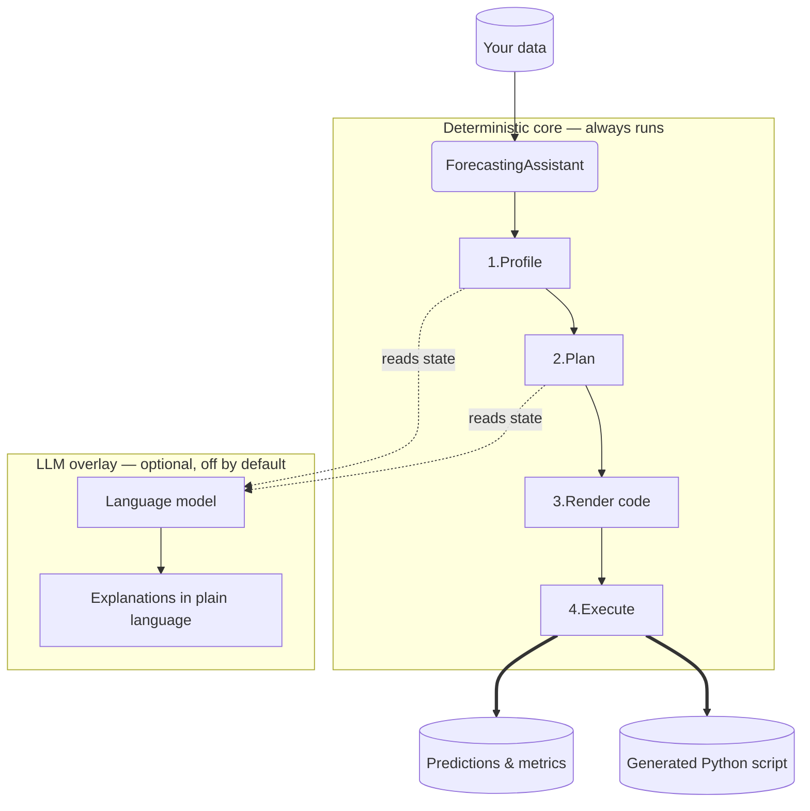

# How it works & trust

Most "AI" forecasting tools ask you to trust a black box. **skforecast-ai** is built on the opposite principle: it **separates execution from reasoning**. All forecasting decisions are made by transparent, rule-based Python — not by a language model — so results are 100% deterministic and reproducible. A language model, when you choose to enable one, only *explains* what the deterministic engine did. It never changes the math.



> The right-hand box is entirely optional. With no model configured, profiling, planning, code generation, and execution all run exactly the same.

## Two modes of operation

**Deterministic mode (the default).** Create the assistant with no arguments and it runs the full pipeline — from profiling to execution — without an internet connection or an API key. Every method except `ask()` works in this mode.

```python
from skforecast_ai import ForecastingAssistant

assistant = ForecastingAssistant()          # deterministic — no key, no network
```

**LLM mode (opt-in).** Configure a provider with the `llm="provider:model"` string. The model can then read the pipeline's internal state — for example, *why* an `LGBMRegressor` was chosen over `Ridge` — and answer questions about it in plain language through [the `ask()` interface](using-the-ai-assistant.md). Calling `ask()` without a configured model raises `LLMRequiredError`.

```python
assistant = ForecastingAssistant(llm="openai:gpt-4o-mini")   # explanations enabled
```

The crucial point: switching on the LLM adds *explanations*. It does not change which forecaster runs, which lags are used, or what predictions come out. Run the same data twice, with and without an LLM, and the numbers are identical.

## The fidelity guarantee: the code shown is the code that ran

When you call `forecast()`, the assistant generates a `skforecast` script and then executes that exact script using Python's native `exec()` in an isolated namespace. The string you read from `result.code` is not a reconstruction written after the fact — it is the literal source that produced `result.predictions`.

This has three practical consequences:

1. **You can audit before you trust.** Inspect `result.code` (or call [`forecast_code()`](reproducible-code.md) to get it *without* running anything) and read exactly what will happen — which model, which lags, which preprocessing.
2. **You can reproduce it anywhere.** Copy the script into a `.py` file and run it with plain `skforecast`. No dependency on skforecast-ai at runtime.
3. **Execution is isolated.** The generated code runs against an in-memory copy of your DataFrame; it does no hidden disk I/O, and in deterministic mode it makes no network calls.

If the generated code ever fails at runtime, the error is wrapped in a `ForecastExecutionError` that carries both the generated code and the full traceback, so you can see precisely where it broke. See [Troubleshooting](troubleshooting.md).

## Knowledge as Code: how explanations stay honest

The risk with any AI explainer is **drift**: the engine applies one rule, but the model explains a different one from outdated training data, and trust collapses.

skforecast-ai prevents this with a pattern called **Knowledge as Code**. The best practices and heuristic thresholds the assistant follows are written up as plain Markdown files — called **skills** — that live in the source tree under `skforecast_ai/skills/`. There are 16 of them, covering topics like choosing a forecaster, lag selection, backtesting configuration, and prediction intervals.

Two things make this trustworthy:

- **Skill selection is rule-based, not a vector search.** When you ask a question, the assistant deterministically selects the relevant skills based on your task type and the keywords in your question, then gives them to the model as grounding. There's no fuzzy retrieval guessing what's relevant.
- **The engine does not read skills at runtime.** The recommendation rules are hardcoded in Python. The skill documents *mirror* those rules by convention — they're the human- and LLM-readable description of the same logic, kept in sync deliberately. Editing a skill updates the documentation and what the LLM says; it does not silently change engine behavior.

Because the skills are just files in the repository, you can read them yourself to see the exact rules the assistant is bound by.

## Privacy

By default the assistant does **not** send your raw data to the LLM — only the structural profile and the modeling decisions, which is what the model needs to explain its reasoning. If you want the model to see the underlying values, opt in explicitly:

```python
assistant = ForecastingAssistant(llm="openai:gpt-4o-mini", send_data_to_llm=True)
```

## Next steps

- **[The forecasting workflow](the-forecasting-workflow.md)** — see the steps and the objects passed between them in detail.
- **[Reproducible code](reproducible-code.md)** — get the auditable script without executing it.
- **[Using the AI assistant](using-the-ai-assistant.md)** *(optional)* — turn on and configure the explanatory model.
