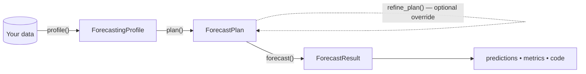

# The forecasting workflow

In [Your first forecast](first-forecast.md) you called a single method, `forecast()`, and got predictions back. That convenience method hides a small, predictable pipeline. Understanding it lets you inspect what the assistant decided, override any step, and get the generated code without running it.

The whole workflow is a chain of four steps. Each step takes the output of the previous one and produces a new, well-defined object:



You can run the whole chain at once with `forecast()`, or call each step yourself when you want to see — or change — what happens in between.

## The steps

### 1. `profile()` — understand the data

```python
from skforecast_ai import ForecastingAssistant

assistant = ForecastingAssistant()
profile = assistant.profile(data, target="y", date_column="date")
```

`profile()` returns a **`ForecastingProfile`**. It answers two questions:

- *What is this data?* — frequency, gaps, missing values, number of series, exogenous columns. These structural facts live on `profile.data_profile`.
- *What should we model with?* — the coarse decisions: which `forecaster` family and `estimator` to use, the ordered `forecaster_candidates` / `estimator_candidates` you could switch to, and the `task_type` (`single_series`, `multi_series`, `multivariate`, `statistical`, or `foundation`).

`profile.explanation` is a plain-language summary of why those choices were made. See [Understanding your data](understanding-your-data.md) for the structural side, and [Customizing the model](customizing-the-model.md) for the modeling decisions.

### 2. `plan()` — decide exactly how to forecast

```python
plan = assistant.plan(profile, steps=12)
```

`plan()` turns the coarse profile into a complete, concrete **`ForecastPlan`**: the final `lags`, the evaluation `metric`, prediction `interval` settings, NaN handling, and preprocessing steps. `steps` (the forecast horizon) is required here.

A `ForecastPlan` is a *declarative blueprint* — it describes exactly how the forecast will run, independent of any actual Python code.

### 3. `refine_plan()` — override decisions (optional)

If you disagree with any decision, adjust it before running:

```python
plan = assistant.refine_plan(profile, plan, estimator="LGBMRegressor", steps=24)
```

`refine_plan()` accepts the override keys `forecaster`, `estimator`, `estimator_kwargs`, `steps`, and `interval`. Everything else in the plan is preserved. This step is covered in detail in [Customizing the model](customizing-the-model.md).

### 4. `forecast()` — run it

```python
result = assistant.forecast(data, target="y", steps=12, date_column="date",
                            profile=profile, plan=plan)
```

`forecast()` renders the plan into a `skforecast` script, executes it, and returns a **`ForecastResult`** with `predictions`, `metrics`, `code`, and optional `intervals`.

Passing `profile=` and `plan=` reuses the work you already did. Omit them and `forecast()` runs `profile()` and `plan()` for you internally — which is exactly what the one-line call in [Your first forecast](first-forecast.md) does.

## `forecast()` vs `forecast_code()`

There are two ways to finish the workflow, depending on whether you want results or just the script:

| Method | Returns | Use it when |
| --- | --- | --- |
| `forecast()` | `ForecastResult` — predictions, metrics, and `code` | You want the actual forecast now. |
| `forecast_code()` | `CodeGenerationResult` — the script, **not executed** | You want to inspect, modify, or deploy the code yourself first. |

Both produce the *same* script for the same inputs. `forecast()` runs it; `forecast_code()` just hands it to you. See [Reproducible code](reproducible-code.md).

## The public methods at a glance

| Method | Returns | Purpose |
| --- | --- | --- |
| `profile(...)` | `ForecastingProfile` | Inspect the data and make coarse modeling decisions. |
| `plan(...)` | `ForecastPlan` | Produce the detailed, declarative blueprint. |
| `refine_plan(...)` | `ForecastPlan` | Apply your overrides to a plan. |
| `forecast_code(...)` | `CodeGenerationResult` | Generate the standalone script without running it. |
| `forecast(...)` | `ForecastResult` | Run the full pipeline and return results. |

For walk-forward evaluation there is a parallel trio — `create_cv()`, `backtest_code()`, and `backtest()` — covered in [Backtesting & validation](backtesting.md).

## Why a pipeline of plain objects?

Every step produces an inspectable object you can print, store, or hand to the next call. Nothing is hidden in a model's internal state, and the final `result.code` is the literal script that ran. The design principle behind that guarantee — and the optional LLM layer that can *explain* these objects without ever changing them — is described in [How it works & trust](how-it-works-and-trust.md).
